# SETU | Full Stack Web Development 2 | MoviesApp

This is a simple project for learning full stack web development based upon a template called 'MoviesApp' created by Frank Walsh (Lecturer at SETU, Waterford, Ireland).

This is an implementation of a client-side rendering web app using React + TypeScript with Vite and styled using MUI (Material UI). It integrates Supabase for backend services and supports internationalization via i18next.
The project includes Storybook for UI component development and uses React Query and React Hook Form for data fetching and form handling.

# What this project does

Its purpose is simply to fetch movies data from the [TMDB](https://www.themoviedb.org/) database, and render them in a user-friendly manner, so that the user can get a full picture of the movies available in the database, what the upcoming ones are, and so on and so forth.
The user will also be able to get more fine-grained data/information about movies when landing on a dedicated movie page, or simply to get to know some bio info regarding the cast and the movies they play into.
Eventually, the user will also get the chance to create their own list of favourite movies, and, or a list of the movies they feel they should not miss out on (in a nutshell, a must-watch movies list). It goes without saying that the features just above-mentioned are tied to signing up to the app in order to get an account created, so that persistence of their chosen data can be ensured via the use of the [Supabase](https://supabase.com/) back-end logic.

# Why the project is useful

The project is useful for those users that would like to know more about the world of movies, and TV overall, and their cast. Additionally, the MoviesApp rolls out a feature to create useful lists for the type of user who does not want to miss a beat when it comes to the latest movie releases, and so and so forth.

Apart from all of the above, the very main purpose of the project was for the writer to be exposed to the use of [React.js](https://react.dev/), [Material UI](https://mui.com/material-ui/), [Storybook](https://storybook.js.org/), [Typescript](https://www.typescriptlang.org/), but also to rehash some previously acquired knowledge on CSS.

The ultimate idea here would have also been to expand the website insofar that it would have included a search bar to be able to fetch a movie simply by typing down a title or just simply using a promp. Alas, technical challenges at this stage of my study are not always easy to overcome.
Nevertheless, I count on filling this knowledge gap down the road as I move ahead with the course in the next few months.

# How users can get started with the project

## Navigation Header

As a user opens up the **MoviesApp** app, they will see a sticky nav bar on the top for an easy navigation throughout the website:

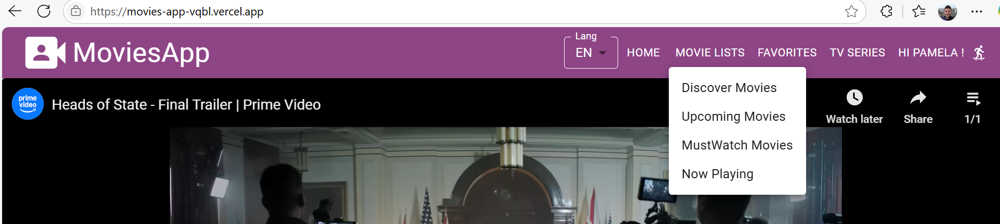

This is generated by the **siteHeader/index.tsx** file, and , as it can be observed in the above screenshot, tt features the app title, and logo on the left, offering a clear identity across all pages. A language switcher is integrated using i18next, allowing users to easily change the app's language based on preference or location.
The header includes user authentication controls powered by Supabase, and also adapts seamlessly to different screen sizes, ensuring a smooth experience on both mobile and desktop. Built with MUI, the header supports theming and offers a responsive layout.
The layout adapts using MUI’s useMediaQuery hook, enabling a hamburger menu on smaller devices while showing full navigation options on larger screens.
In a nutshell, the below function creates a media query string like (max-width:1279.95px), using the Material UI theme’s breakpoint system in. It is basically seeting a break point for screen whose size is less than 1280px, such as on phones, tablets, or small windows. We use then use a [boolean](https://developer.mozilla.org/en-US/docs/Web/JavaScript/Reference/Global_Objects/Boolean) value to render a hamburger menu on smaller screens and a full menu on larger screens setting the mobileAchorEl to 'true' or 'false'.
'mobileAnchorEl' holds a reference to the DOM element (typically an icon button) that opened the mobile hamburger menu. If it contains an element, the menu opens and is anchored relative to that element.
'setMobileAnchorEl' updates that reference (usually on a click).

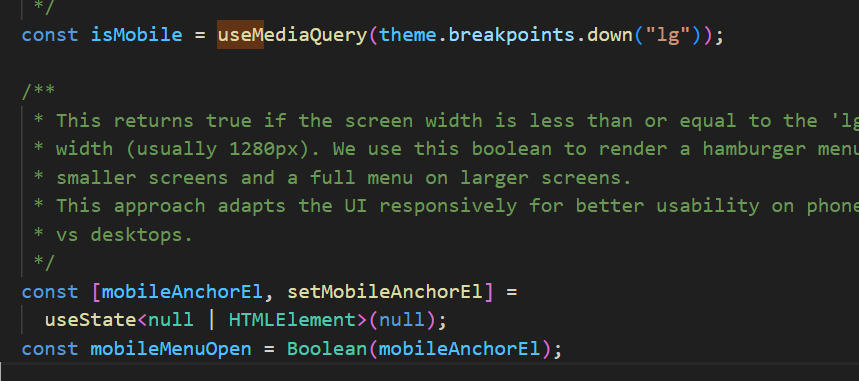

Then, it anchors to

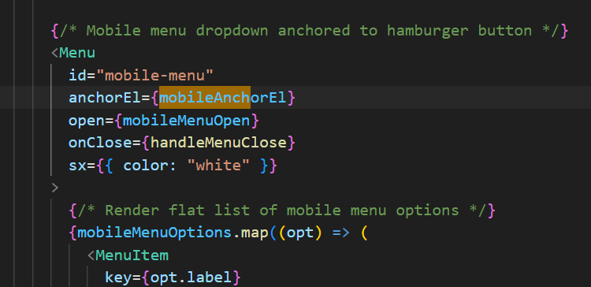

By the same token, 'movieMenuAnchorEl' stores the anchor element for the 'Movie Lists' submenu in the desktop view. When a user clicks on the 'Movie Lists' button, this element gets stored, opening the dropdown.

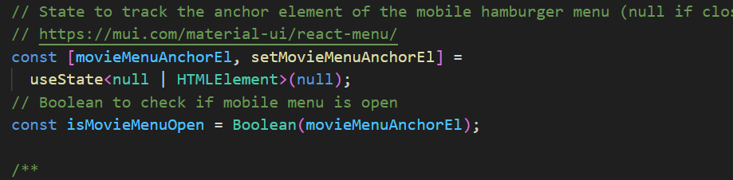

Then, it anchors to

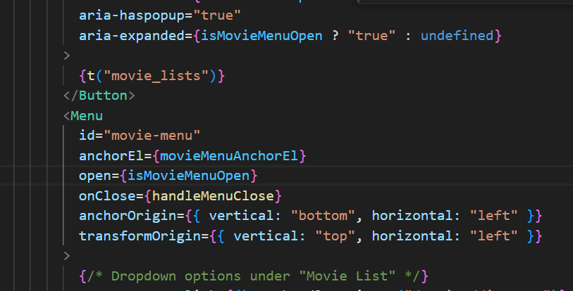

'isMovieMenuOpen' becomes true when the submenu should be displayed.

If 'mobileAnchorEl' or 'movieMenuAnchorEl' is 'null', then, the hamburger or the 'Movie Lists' dropdown menu will be closed:

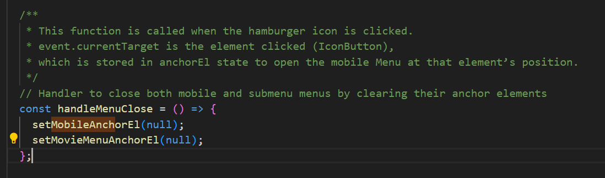

Additionally, as we have done in most of the components and pages, we have used the translations hook useTranslations() to get the 't' function, and i18n instance inside our functional component **i18n.ts**:

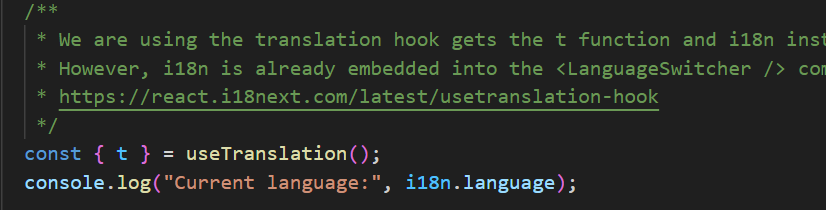

By simply replacing the hard-coded content with the below i18n tags, we will be able to fetch the translated contnet as we switch language on the Language Switcher:

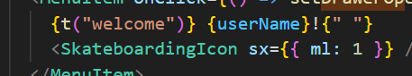

Last but not least, we also use 'useContext' hook to read values from our **AuthContext.tsx** file. If we get a token then the user is authenticated via 'Supabase'.
The 'user' contains the firstName that we will name 'userName' here, which will be used to set up the below local state:

```
const [userName, setUserName] = useState("User");
```

This is shown in the UI (like “Welcome, User!”) until it gets updated with real data when 'userName' gets updated and a token changes through useEffect():

```
useEffect(() => {
  setUserName(user?.firstName ?? "User");
}, [token, user]);

```

This useEffect runs when the component mounts, and any time a user or a token changes and it updates userName to user.firstName, or falls back to "User" if that’s not available:

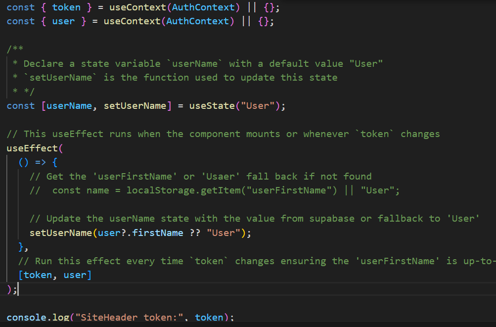

### Source attribution

- https://mui.com/material-ui/react-menu/
- https://mui.com/material-ui/react-menu/#basic-menu
- https://mui.com/material-ui/material-icons/?selected=Skateboarding
- https://mui.com/material-ui/material-icons/?selected=Login
- https://react.i18next.com/latest/usetranslation-hook

### User Profile Drawer

This **UserProfileDrawer/index.tsx** component implements a slide-in panel that displays the current user's profile information.
It accepts two props from the parent component:

- 'open', which is a 'boolean' that controls whether the drawer is visible
- 'onClose', which is a function that closes the drawer.

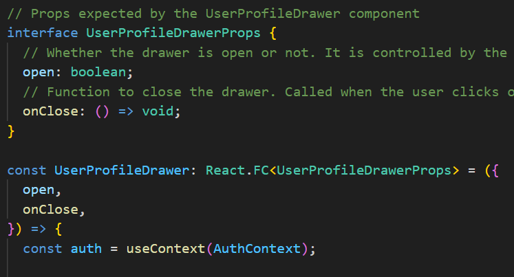

Inside the component, React's useContext is used to access the user object and, hence, data from the **AuthContext.tsx** component, but, also, to handle the signout(). We are, then, fetching the user first name, last name and email to be able to display them in the slide-in panel:

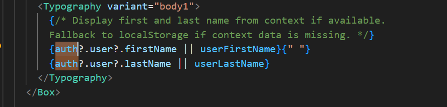
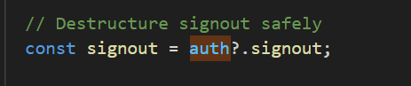

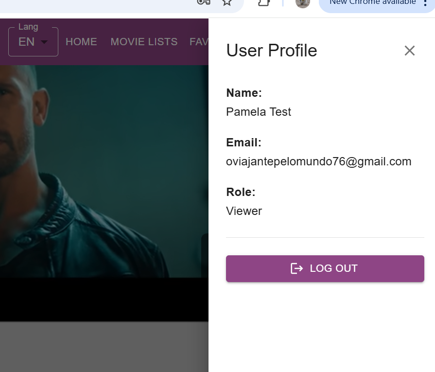

To support the translations feature, just like in the **siteHeader/index.tsx** component, we will keep using the useTranslation hook from react-i18next, which provides translated UI labels based on the current language setting (we won't be making further references to it as it is used throughout the app, although some further mention might be need in some files).

The component attempts to retrieve the user's first name, last name, email, and role from the **AuthContext.tsx** component, as mentioned. Hoever, it can also fall back to pre-defined values. As a matter of fact, the below section might kick in if Supabase fails to return the user's data:

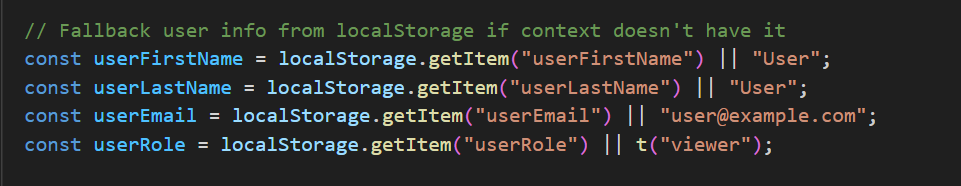

This section is actually part of a previous step of our development journey when the Supabase datastore had not yet been set up in our app, and were, hence, using the local storage to store user's data. We found it convenient to keep this section on to piggyback on it and use the generic data fallback in it, should Supabase fail to deliver the user data:

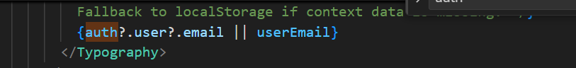

This component uses useState() to manage drawer-specific interactions like toggling visibility, although the drawer open state is mainly controlled by the parent (the siteHedaer). The user information is displayed using Material UI's layout components like 'Box' and 'Typography', styled with spacing and font variants.
A 'Divider' separates the content from the bottom action area, which includes a prominent logout button.

### Source attribution

- https://mui.com/material-ui/react-drawer/
- https://mui.com/material-ui/react-divider/
- https://www.codingeasypeasy.com/blog/mastering-material-ui-drawer-a-comprehensive-guide-with-examples

## Auth Context Provider

The **AuthContext.tsx** component sets up a centralized authentication state for the entire app using React Context, and Supabase. The most important function of this context file is to provide token, user, authenticate, and signout to any component that needs access to auth information.

The useState hook initializes the token and user state, which defaults to a basic guest user profile until login:

```
 const [token, setToken] = useState<string | null>(null);

  /**
   * Declare a state variable `user` with a default value "User"
   * `setUser` is the function used to update this state
   * */
  const [user, setUser] = useState<User>({
    firstName: "User",
    lastName: "User",
    email: "user@example.com",
    role: t("viewer"),
  });
```

The authenticate function, wrapped with useCallback to avoid unnecessary re-creation (as prompted by Typescript), fetches the metadata from a Supabase authenticated user, and updates the app’s state. In addition to that, it redirects users back to the page they originally intended to visit after login:

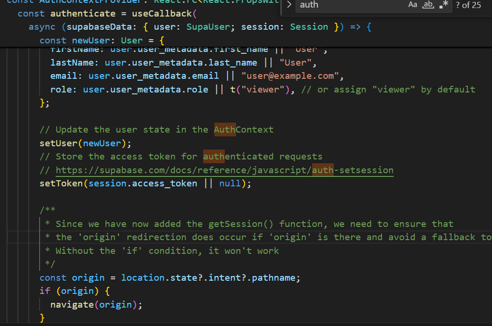

On component mount, the useEffect hook runs the fetchSession() to check if a user session already exists, and if it does, it re-authenticates it (this usually happens when refreshing the brwoser):

```
 useEffect(() => {
    async function fetchSession() {
      // https://supabase.com/docs/reference/javascript/auth-getsession
      // https://github.com/orgs/supabase/discussions/32783
      const { data, error } = await supabase.auth.getSession();
      if (error) {
        console.error("Failed to restore session");
        return;
      }
      console.log("getSession(): ", data.session, error);
      // We create a const variable called 'session'
      const session = data.session;
      // If the session and user of that session exist, then, we will authenticate them again and
      // the session will be restored (authenticate() takes the 2 values as per 'const { user, session } = supabaseData;')
      if (session && session.user) {
        authenticate({ user: session.user, session });
      }
    }

    fetchSession();
  }, [authenticate]);

```

The signout function. instead, handles logging out the user via Supabase, clearing the token, and navigating them back to the home page:

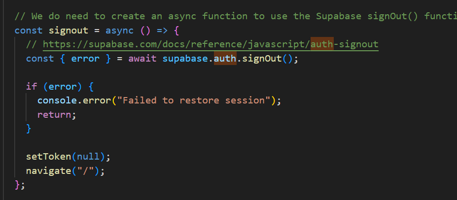

Finally, the provider wraps all children components, making the authentication data and methods available throughout the app:

```
 return (
    <AuthContext.Provider
      value={{
        token,
        user,
        authenticate,
        signout,
      }}
    >
      {props.children}
    </AuthContext.Provider>
  );
};

export default AuthContextProvider;

```

This architecture ensures secure, consistent user session management, and exercises a pivotal role for the back-end user data persistence, which will be further discussed down this document.

### Source attribution

- https://react.i18next.com/latest/usetranslation-hook
- https://react.dev/reference/react/useCallback
- https://supabase.com/docs/reference/javascript/auth-setsession
- https://supabase.com/docs/reference/javascript/auth-getsession
- https://github.com/orgs/supabase/discussions/32783
- https://supabase.com/docs/reference/javascript/auth-signout

## Sign up page

The **signUpPage.tsx** creates a user registration page leveraging Supabase for the backend authentication, as already mentioned in the **AuthContext.tsx** section above.

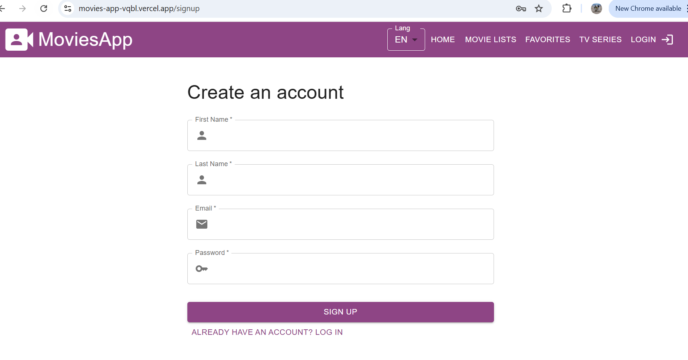

It first initializes state with useState to track values for first name, last name, email, and password, as well as a boolean nameError to manage validation:

```
const [firstName, setFirstName] = useState("");
const [lastName, setLastName] = useState("");
const [email, setEmail] = useState("");
const [password, setPassword] = useState("");
const navigate = useNavigate();
const [nameError, setNameError] = useState(false);

```

At this point, we wanted to input a function to handle ('handleSignUp') the data inputted by the user, but with the caveat of first checking if any of the inputted fields were empty. To that end, we used the trim() function to avoid any whitespace and ensure that the fields are indeed filled.
If empty, it sets the nameError state to true and exits early to prevent sign-up.
Otherwise, it clears the error by setting nameError to false and continues the process:

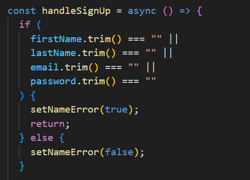

If the inputs are valid, the useState hooks will be updated and the 'e.target.value' on the 'onChange' listener will grab the inputs, and setFirstName(), setLastName() and so on, whereas the 'onClick={handleSignUp}' on the form button will push the inputted data to the Supabase backend:

```
Ex.
...
 <TextField
              fullWidth
              required
              id="outlined-required"
              label={t("first_name")}
              margin="normal"
              value={firstName}
              onChange={(e) => setFirstName(e.target.value)}
              error={nameError}
              helperText={nameError ? t("first_name_text") : ""}
              InputProps={{
                startAdornment: (
                  <InputAdornment position="start">
                    <PersonIcon />
                  </InputAdornment>
                ),
              }}
            />
            ...

             <Button
              variant="contained"
              // color="primary"
              fullWidth
              sx={{
                mt: 3,
                bgcolor: "#8E4585",
                color: "#ffffff",
              }}
              onClick={handleSignUp}
            >
              {t("sign_up")}
            </Button>
            <Button
              onClick={() => navigate("/login")}
              sx={{
                color: "#8E4585",
              }}
            >
              {t("account_exist")}
            </Button>
```

We're calling Supabase's signUp() function to create a new user with the inputs email and password.
Inside options.data, we send extra metadata like first_name and last_name, which Supabase stores in the user profile.
If the signup succeeds, data holds the user/session info. If anything goes wrong, error will contain the error details:

```
    // Call Supabase signUp
    // https://supabase.com/docs/guides/auth/managing-user-data
    const { data, error } = await supabase.auth.signUp({
      email,
      password,
      options: {
        data: {
          first_name: firstName,
          last_name: lastName,
        },
      },
    });

    if (error) {
      console.error("Error signing up:", error.message);
      // Optionally display this error to the user
      return;
    }
```

In this file, we have also introduced the use of useEffect() hook to set the browser title dynamically based on the selected language:

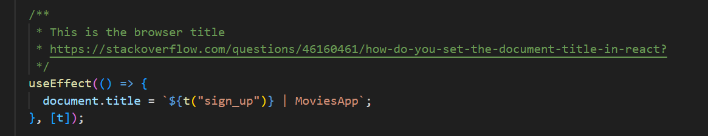

This is replicated across all pages.

### Source attribution

- https://react.i18next.com/latest/usetranslation-hook
- https://stackoverflow.com/questions/46160461/how-do-you-set-the-document-title-in-react
- https://muhimasri.com/blogs/mui-validation/
- https://supabase.com/docs/guides/auth/managing-user-data
- https://mui.com/material-ui/api/input-adornment/

### Protected Routes

The **routes/protectedRoutes.tsx** file is used to guard routes that require authentication.
It uses useContext to access the AuthContext, which provides the current user's authentication token.

```
  const authContext = useContext(AuthContext);
  const { token } = authContext || {};

```

The useLocation hook captures the current route so that after login, the user can be redirected back to their intended destination. However, we noticed that the useLocation() was more effective when used directly into the 'log in' page.

The Navigate component handles the redirect to /login. If the token exists, the user is allowed to access the protected content.

```
 if (!token) {
    return <Navigate to={"/login"} replace state={{ intent: location }} />;
  }

  return props.children;
};
```

The component returns its children, which represent the protected route content. This ensures only authenticated users can access certain parts of the app.

## Source attribution

- https://tutors.dev/talk/full-stack-2-2024/topic-5/talk-3

## Log in page

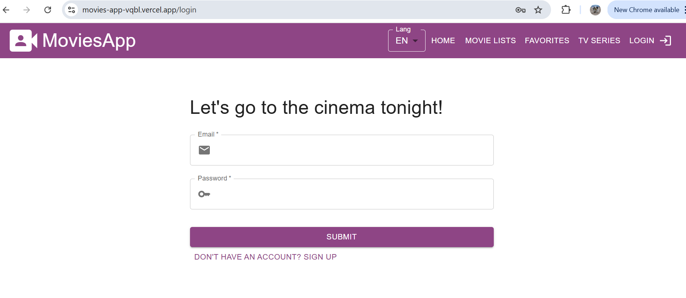

The **loginPage.tsx** uses useState hook to manage form inputs such as email, password, and error states:

```
 // useSate() hooks for storing user input from the login form.
  const [email, setEmail] = useState("");
  const [password, setPassword] = useState("");

  const [emailError, setEmailError] = useState(false);
  const [passwordError, setPasswordError] = useState(false);
```

The rationale behind creating separate errors was to trigger a targeted response to handle empty field errors, so that if the email text filed was empty, it would trigger the 'emailError' only, and vice versa.

The useState() hook for:

```
const [loginError, setLoginError] = useState("");
```

would be triggered to handle incorrect data inputted by the user.

When the user clicks the login button, the login function validates email and password fields, marking errors if empty.
If errors exist ('hasError'), it sets a translated login error message and exits early. To do that, we first created a 'hasError' boolean variable which would be 'true' or 'false' based upon whether the text fileds are empty (to ensure a sanitized input we use the trim() which removes any whitespac).
In the end, if 'hasError' turns out 'true', the loginError kicks in:

```
const login = async () => {
    // Create a boolean variable which indicates whether the error exists or not
    let hasError = false;
    // The email field can't be empty
    if (email.trim() === "") {
      setEmailError(true);
      hasError = true;
    } else {
      setEmailError(false);
    }

    // The password field can't be empty
    if (password.trim() === "") {
      setPasswordError(true);
      hasError = true;
    } else {
      setPasswordError(false);
    }

    // Error message
    if (hasError) {
      setLoginError(t("incorrect_credentials"));
    }
```

if no error is detected, the credentials are pushed to Supabase using signInWithPassword(), after the 'onChange listener detects the useStae hook state change and grabs the new email and password values in the text field tags:

```
Ex.
onChange={(e) => setEmail(e.target.value)}

```

If Supabase returns an error, it logs and displays it, but if the login is successful, it clears errors and calls the authenticate function from context:

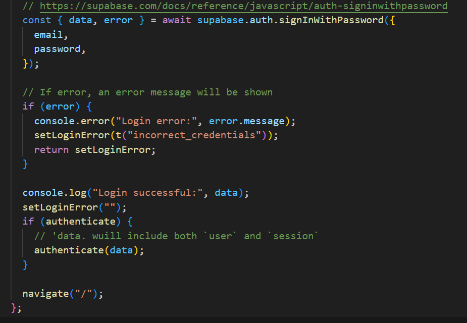

This updates the global auth state with the user and session.
Finally, it redirects the user to the home page using navigate("/").

Of course, the very first step was to actually extract the 'authenticate' function from the AuthContext using React's 'useContext' hook.
If 'useContext(AuthContext)' returns 'null' or 'undefined', it safely falls back to an empty object '({})', which averts an error during destructuring:

```
 const { authenticate } = useContext(AuthContext) || {};

```

The form is responsive and accessible, and the navigate hook redirects users after login or to the signup page.

### Source attribution

- https://v5-0-6.mui.com/components/text-fields/
- https://www.php.cn/faq/1796604601.html
- https://react.i18next.com/latest/usetranslation-hook
- https://stackoverflow.com/questions/46160461/how-do-you-set-the-document-title-in-react
- https://muhimasri.com/blogs/mui-validation/
- https://supabase.com/docs/reference/javascript/auth-signinwithpassword

## supabaseClient file

This file basically installs and sets up the Supabase TypeScript client in the MoviesApp project.
The @supabase/supabase-js package is first installed using npm.

```
npm install @supabase/supabase-js
```

Then, 'createClient' is imported to initialize a Supabase client with a URL and an API key. These credentials are securely loaded from environment variables using import.meta.env.

Finally, the configured Supabase client is exported for use throughout the app.

### Source attributions

- https://supabase.com/dashboard/project/mydashsboard,
- https://supabase.com/dashboard/project/{supabaseURL}/api

## moviesContext file

This **contexts/movieContext.tsx** file defines a React context to manage our app movie data, such as 'favourites' and 'must watch' movies. It integrates with Supabase for persistent storage, allowing the app to sync user data between sessions and across devices. The context provides methods to add or remove movies from two separate lists: 'favourites' and 'must watch' lists. Additionally, It manages the add review feature.

State is managed using React's useState.

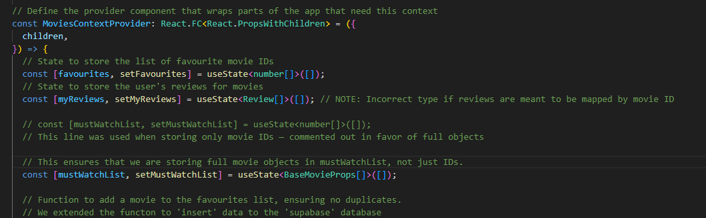

and functions like useCallback ensure stable references for performance.

```
 // Function to add a movie to the favourites list, ensuring no duplicates.
  // We extended the functon to 'insert' data to the 'supabase' database
  const addToFavourites = useCallback(async (movie: BaseMovieProps) => {
    setFavourites((prevFavourites) => {
      const movieId = Number(movie.id); // Convert to number
      if (!prevFavourites.includes(movieId)) {
        console.log("Adding to favourites:", movieId);
        return [...prevFavourites, movieId];
      }
      return prevFavourites;
    });
```

When a user logs in, the user is authenticated and their stored data is fetched from Supabase.

```
/**
     * We retrieve the user data from the supabase database
     * https://supabase.com/docs/reference/javascript/auth-getuser
     */
    const {
      data: { user },
      error: userError,
    } = await supabase.auth.getUser();

```

We then query the favourites SQL table we created in Supabase using .select() with filters: 'user_id' and 'movie_id'.
The '.maybeSingle()' method ensures it returns a single row or null.
If a matching record already exists, it logs a message and exits to avoid duplicating the entry.

```
/**
     * This function will enable us to avoid duplicates. Essentially, we are
     * 'selecting' the id of the movie addition, and checking 'user_id' and 'movie_id'
     * to find the existing one and append maybeSingle() to Return data as a single object
     * instead of an array of objects, meaning it won't get duplicated.
     * https://supabase.com/docs/reference/javascript/maybesingle
     *  */
    const { data: exist, error: selectError } = await supabase
      .from("favourites")
      .select("id")
      .eq("user_id", user.id)
      .eq("movie_id", movie.id)
      .maybeSingle();

    if (selectError) {
      console.error("Error checking existing favourite: ", selectError.message);
      return;
    }

    if (exist) {
      console.error(
        "This movie already exists in your favourite movies list: ",
        movie.title
      );
      return;
    }
```

If no duplicate is found, it inserts a new row into the favourites table with the user ID, movie ID, title, and poster path.
If insertion fails, it logs the error.
If successful, it logs a success message confirming the movie was added to the user's favourites in the database.

```
/**
     * We then insert the favourite movie to supabase based upon the table structure
     * we created in the supabase SQL Editor
     * https://supabase.com/docs/guides/auth/managing-user-data
     * https://supabase.com/docs/guides/database/postgres/row-level-security
     * https://supabase.com/docs/reference/javascript/insert
     */
    const { error } = await supabase.from("favourites").insert({
      user_id: user.id,
      movie_id: movie.id.toString(),
      movie_title: movie.title,
      poster_path: movie.poster_path,
    });

    if (error) {
      console.error("No data inserted in Supabase: ", error.message);
    }

    console.log(
      "Successfully added this movie to Supabase favourites: ",
      movie.title
    );
  }, []);
```

In short, the function updates both local state and remote storage (Supabase), ensuring data consistency and avoiding duplicates.

This is a screenshot of the 'favourites' SQL table created on Supabase, which we query:

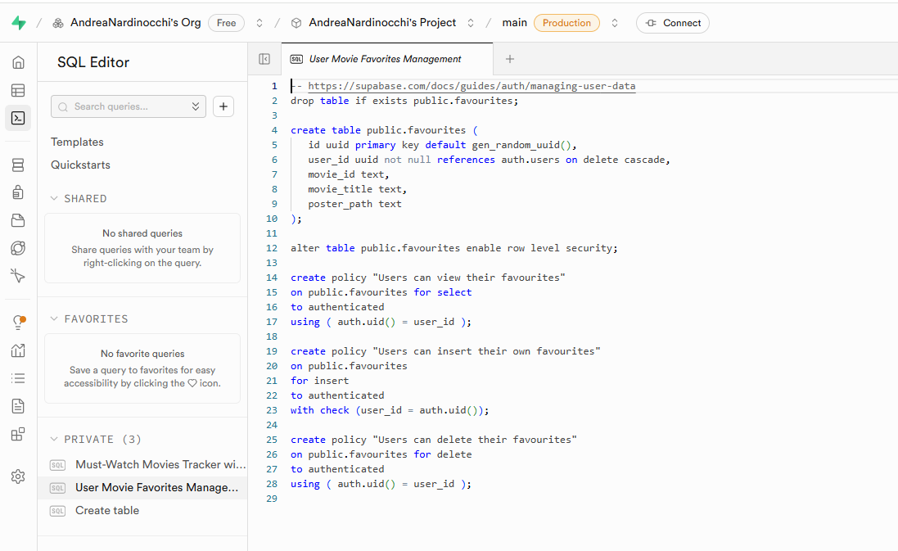

The function 'fetchSupabaseFavouriteMovies' fetches the list of favourite movies for a given user from Supabase and does that by using filters such as the 'userId' to enure we are fetching data of that specific user:

```
/**
   * Fetches the list of favourite movies for a given user from Supabase.
   * useCallBack() lets us cache a function definition between re-renders.
   *https://react.dev/reference/react/useCallback
   */
  const fetchSupabaseFavouriteMovies = useCallback(async (userId: string) => {
    /**
     * Use Supabase to query the "favourites" table
     * where the "user_id" column matches the provided userId
     * https://supabase.com/docs/reference/javascript/using-filters
     */
    const { data, error } = await supabase
      .from("favourites")
      .select()
      .eq("user_id", userId);

    // If error, we will get the below message
    if (error) {
      console.error("User not found", error.message);
      return;
    }
     // If data is successfully returned, map through the movie to extract the movie_id value,
    // and update the component's state const [favourites, setFavourites] = useState<number[]>([]);
    if (data) {
      // We amended this since we had declared the useState for the const favourites as an array of numbers
      // Also, 'm' is a better label than 'movie', which is an object, but we are essentially fetchin a value from
      // the supabase table row
      // const ids = data.map((movie) => movie.movie_id);
      const ids = data.map((m) => Number(m.movie_id));
      setFavourites(ids);
    }
  }, []);

```

If 'data' is returned, we extarct the movie ids by 'mapping' the data for then set them up in the favourite list (updating the state hook).

At this point, the following useEffect() hook will act out as a helper by enabling to load the user's favourite movies when the component mounts, so that any time the 'fetchSupabaseFavouriteMovies' function changes the 'favourites' are fetched:

```
/**
   * useEffect here enables to load the user's favourite movies when the component mounts.
   * Any time the `fetchSupabaseFavouriteMovies` function changes the favourites are fetched
   */
  useEffect(() => {
    const loadUserFavourites = async () => {
      const {
        data: { user },
        error: userError,
      } = await supabase.auth.getUser();

      if (userError || !user) {
        console.error("User not found", userError?.message);
        return;
      }

      fetchSupabaseFavouriteMovies(user?.id);
    };

    loadUserFavourites();
```

It is now that we need to set up a listener by calling 'supabase.auth.onAuthStateChange()' to listen for sign-in or sign-out events, so that If a user signs in, it fetches their favourites again using their session user ID. If a user signs out, it clears the local favourites list using setFavourites([]).

```
 /**
     * This sets up a listener to detect changes in the authentication user state
     * SIGNED_IN: Emitted each time a user session is confirmed or re-established, including on user sign in and when refocusing a tab.
     * SIGNED_OUT: Emitted when the user signs out.
     * https://supabase.com/docs/reference/javascript/auth-onauthstatechange
     * */
    const { data } = supabase.auth.onAuthStateChange((event, session) => {
      console.log(event, session);

      if (event === "SIGNED_IN" && session) {
        fetchSupabaseFavouriteMovies(session.user.id);
      } else if (event === "SIGNED_OUT") {
        setFavourites([]); // This will set the favourites list to empty
      }
    });

    // Call unsubscribe to remove the callback NOT WORKING
    // data.subscription.unsubscribe();

    /**
     * The above unsubscribe call was not correctly unsubscribing, and we were
     * ending up showing the same favourites list regardless of the user logging in.
     * Apparently, the correct logic is  return () => { // Cleanup logic };
     * https://devchallenges.io/learn/4-frontend-libraries/side-effects-in-react
     */

    return () => {
      data.subscription.unsubscribe();
    };
  }, [fetchSupabaseFavouriteMovies]); // dependency array

```

When the component is unmounted, the listener is unsubscribed using 'data.subscription.unsubscribe()' inside the return cleanup function.

When ti comes to removing a favourite movie, the 'removeFromFavourites' function, the state updater 'setFavourites' is called with a function that filters out the 'movie.id' from the current favourites array.

```
  setFavourites((prevFavourites) =>
      prevFavourites.filter((mId) => mId !== movie.id)
    );
    console.log("Removing from favourites:", movie.id);

```

This ensures that the UI immediately reflects the removal even before Supabase is updated.

At that point, we retrive the currently authenticated user again via the 'supabase.auth.getUser()' function.

```
 /**
     * We retrieve the user data from the supabase database
     * https://supabase.com/docs/reference/javascript/auth-getuser
     */
    const {
      data: { user },
      error: userError,
    } = await supabase.auth.getUser();
```

Finally, a delete operation is performed on the favourites table, by filtering the deletion and matching both 'user_id', and 'movie_id' to ensure the correct record is removed.

```
/**
     * We delete the favourite movie from supabase
     * https://supabase.com/docs/reference/kotlin/delete
     */
    const { error } = await supabase
      .from("favourites")
      .delete()
      .eq("user_id", user.id)
      .eq("movie_id", movie.id);

    if (error) {
      console.error("No data deleted from Supabase: ", error.message);
    }

    console.log(
      "Successfully deleted this movie from Supabase favourites: ",
      movie.title
    );
  }, []);
```

The 'must watch' list contexts functions follow the same exact logias the 'favourites' list. Howvere, it is worth pointing out a few differences.

One of them is that 'mustWatchList' checks if a full movie object with that id already exists using .find():

```
setMustWatchList((prevMustWatchList) => {
  const alreadyExists = prevMustWatchList.find((m) => m.id === movie.id);
  if (!alreadyExists) {
    return [...prevMustWatchList, movie];
  }
  return prevMustWatchList;
});

```

Also, when fetching 'must watch' movies data, we also pull 'title' and 'poster_path', and reconstructs full objects, whereas 'favouties' only pulls 'movie_id'.

```
// If data is successfully returned, map through the movie to extract the movie_id value,
    // and update the component's state const [mustWatchList, setMustWatchList] = useState<number[]>([]);
    if (data) {
      // We amended this since we had declared the useState for the const favourites as an array of numbers
      // Also, 'm' is a better label than 'movie', which is an object, but we are essentially fetchin a value from
      // the supabase table row
      // const ids = data.map((m) => m.movie_id);
      const movies = data.map((m) => ({
        id: Number(m.movie_id),
        title: m.movie_title,
        poster_path: m.poster_path,
      }));
      setMustWatchList(movies);
    }
  }, []);

```

Finally, when removing a 'must watch' movie, we filter by full movie object (m.id) instead of by id (mId) as for the 'favourites' functions.

```
 setMustWatchList((prevMustWatchList) =>
      prevMustWatchList.filter((m) => m.id !== movie.id)
    );

```

This is the Supabase SQL table:

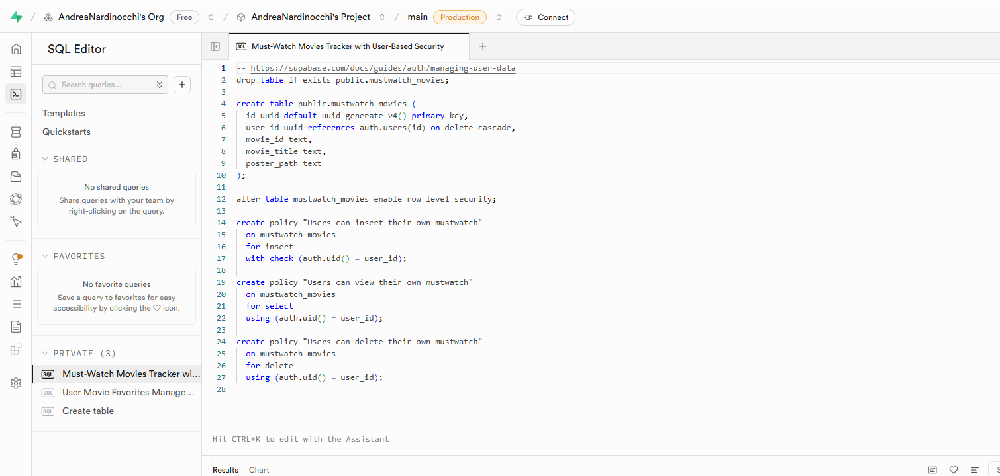

In a nutshell, thanks to this file, we are able to ensure data persistence on a user UI on the 'favourites' and 'must watch' lists.

Screenshots of the Supabase data in each table:

'Must Watch' list

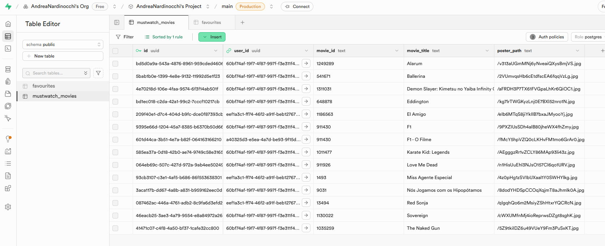

'Favourites'

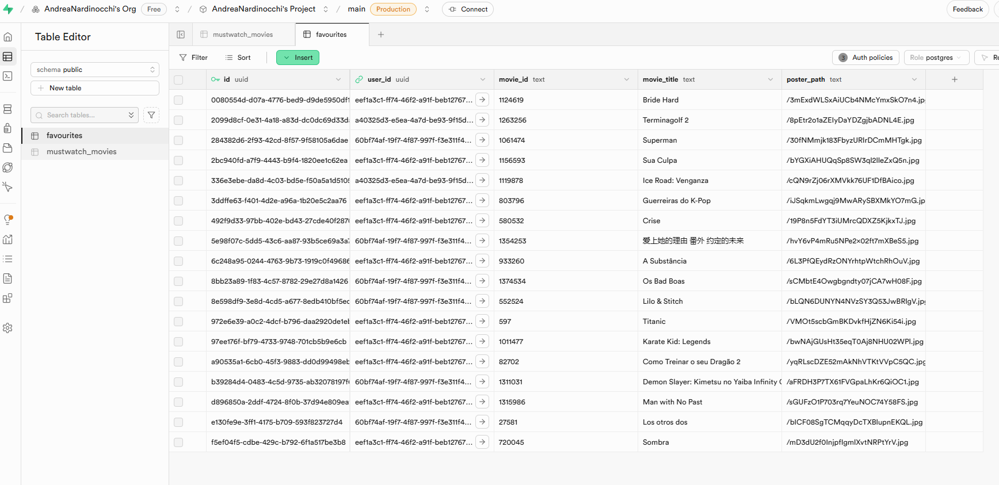

### Source attributions

- https://supabase.com/docs/reference/javascript/auth-getuser
- https://developer.mozilla.org/en-US/docs/Web/JavaScript/Reference/Global_Objects/Array/find
- https://supabase.com/docs/reference/javascript/maybesingle
- https://supabase.com/docs/guides/auth/managing-user-data
- https://supabase.com/docs/guides/database/postgres/row-level-security
- https://supabase.com/docs/reference/javascript/insert
- https://react.dev/reference/react/useCallback
- https://supabase.com/docs/reference/javascript/using-filters
- https://supabase.com/docs/reference/javascript/auth-onauthstatechange
- https://supabase.com/docs/reference/kotlin/delete
- https://devchallenges.io/learn/4-frontend-libraries/side-effects-in-react

## homePage.tsx

The **HomePage.tsx** page is the main landing page for the movie app, which replaces the 'discover movies' which was moved down the 'Movie Lists' dropdown menu.

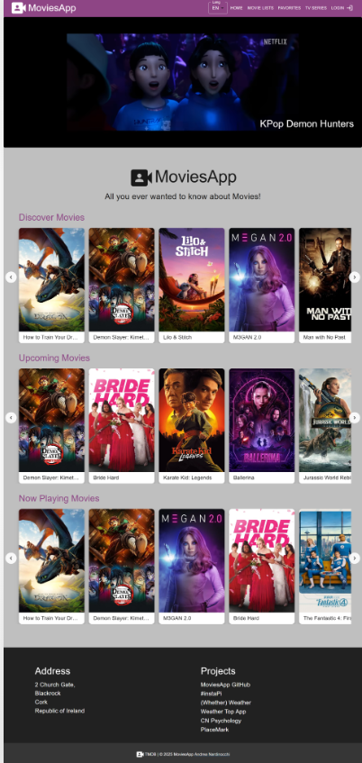

It uses the i18n translation hook to support multiple languages and sets the document title dynamically based on the current language, as all pages, and components where it applies.

It is worth to zero in on the section on the top, which is basically a sort of hero component, which features a randomly selected video from the first 20 ones fetch through the below API function in the **tmdb-api.ts** file:

```
/**
 * Fetches the video trailer of a movie.
 * /**
 * Fetches the video trailer of a movie.
 * https://developer.themoviedb.org/reference/movie-videos
 * 'id' is the ID of the movie and language fetches the language of the video trailer
 */
export const getMovieVideos = (id: string | number, language = "en-US") => {
  return fetch(
    `https://api.themoviedb.org/3/movie/${id}/videos?api_key=${
      import.meta.env.VITE_TMDB_KEY
    }&language=${language}`
  )
    .then((response) => {
      if (!response.ok) {
        throw new Error(
          `Failed to get movie videos. Response status: ${response.status}`
        );
      }
      return response.json();
    })
    .then((json) => json.results) // extract the "results" array
    .catch((error) => {
      throw error;
    });
};


```

The hero video component is the following:

```
const HeroVideoSection = ({
  movie,
  videoKey,
}: {
  movie: BaseMovieProps;
  videoKey?: string;
}) => (
  <Card sx={{ position: "relative", height: "70vh" }}>
    {videoKey ? (
      // https://stackoverflow.com/questions/63842284/autoplay-video-in-react-material-ui-cardmedia-component
      <CardMedia
        component="iframe"
        src={`https://www.youtube.com/embed/${videoKey}?autoplay=1&mute=1&loop=1&playlist=${videoKey}`}
        title={movie.title}
        sx={{ width: "100%", height: "100%", border: "none" }}
        allow="autoplay; encrypted-media"
        allowFullScreen
      />
    ) : (
      <CardMedia
        component="img"
        image={`${IMAGE_BASE}${movie.poster_path}`}
        alt={movie.title}
        title={movie.title}
        sx={{ width: "100%", height: "100%", objectFit: "cover" }}
      />
    )}

    {/* Movie Title Overlay box */}
    <Box
      sx={{
        position: "absolute",
        bottom: "10%",
        right: "1%",
        color: "white",
        backgroundColor: "rgba(0,0,0,0.5)",
        padding: "1rem",
        borderRadius: "8px",
        minWidth: "20%",
      }}
    >
      <Typography variant="h4">{movie.title}</Typography>
    </Box>
  </Card>
);

```

It renders a large visual section using a Card component. If a videoKey is provided, it embeds a YouTube video that autoplays, is muted, and loops:

```
 src={`https://www.youtube.com/embed/${videoKey}?autoplay=1&mute=1&loop=1&playlist=${videoKey}`}
```

If not, it falls back to displaying the movie's poster image.

```
const IMAGE_BASE = "https://image.tmdb.org/t/p/w500";
...

) : (
     <CardMedia
       component="img"
       image={`${IMAGE_BASE}${movie.poster_path}`}
       alt={movie.title}
       title={movie.title}
       sx={{ width: "100%", height: "100%", objectFit: "cover" }}
     />
   )}

```

Additionally, a semi-transparent overlay at the bottom right displays the movie title:

```
 {/* Movie Title Overlay box */}
    <Box
      sx={{
        position: "absolute",
        bottom: "10%",
        right: "1%",
        color: "white",
        backgroundColor: "rgba(0,0,0,0.5)",
        padding: "1rem",
        borderRadius: "8px",
        minWidth: "20%",
      }}
    >
      <Typography variant="h4">{movie.title}</Typography>
    </Box>
```

The YouTube 'videoKey' useState hook will help us construct the YouTube video URL for embedding the trailer in an iframe tag.

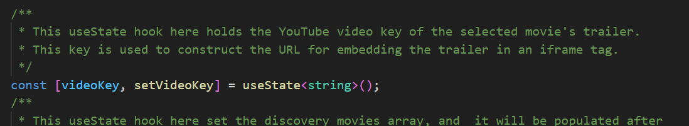

At this point, we will use 'useQuery' from React Query to fetch movies based on the current page and language, while preserving previous data during transitions:

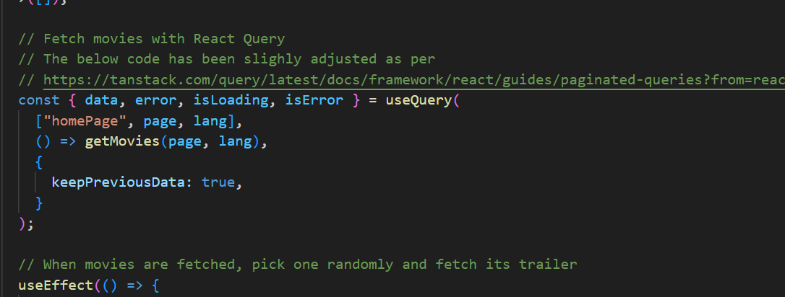

Below, we can observe the API use to fetch movies from the TMDB movie datastore in the **tmdb-api.ts** file:

```
export const getMovies = (page: number, language = "en-US") => {
  return fetch(
    /**  To retrieve page by page for pagination, we added the 'page' parameter, so that,
     * whenever a page is selecetd, the API will show movies belonging to that
     * specific page
     * https://www.themoviedb.org/talk/5e23977c8f26bc0011777a02?
     */

    `https://api.themoviedb.org/3/discover/movie?api_key=${
      import.meta.env.VITE_TMDB_KEY
    }&language=${language}&include_adult=false&page=${page}`
  )
    .then((response) => {
      if (!response.ok)
        throw new Error(
          `Unable to fetch movies. Response status: ${response.status}`
        );
      return response.json();
    })
    .catch((error) => {
      throw error;
    });
};

```

Once the movies are fetched, a useEffect hook runs to select a random movie from the results:

```
 const [randomMovie, setRandomMovie] = useState<BaseMovieProps | null>(null);
 ...

 useEffect(() => {
    const fetchData = async () => {

      if (data?.results?.length) {

        const randomFunction = Math.floor(Math.random() * data.results.length);
        const randomMovie = data.results[randomFunction];

        setRandomMovie(randomMovie);


```

This random movie is then saved to local state for use in the below steps:

```
const videos = await getMovieVideos(randomMovie.id);

       const trailer = videos.find(
         (v: VideoTrailer) => v.type === "Trailer" && v.site === "YouTube"
       );

       setVideoKey(trailer?.key);
     }
```

This code fetches all videos related to a selected movie using its ID ('const videos'). It then searches the results to find the first video that is both a "Trailer" and hosted on "YouTube". If such a trailer exists, its key is stored in state using the setVideoKey.
This is possible as we had previously set up the VideoTrailer interface in the **types/interfaces.ts** file, which defines the shape of a video object with its fields:

```
/**
 * https://developer.themoviedb.org/reference/movie-videos
 */
export interface VideoTrailer {
  key: string;
  site: string;
  type: string;
}
```

The HeroVideo component will finally be rendered in the return if the random movie id exists:

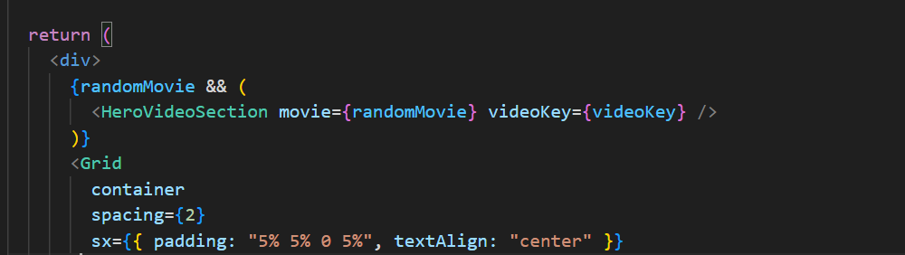

The page layout includes a header with an icon and main title 'MoviesApp All you ever wanted to know about Movies!', followed by three carousels showing different movie categories.
Each carousel is a horizontally scrollable list of movie cards that can be clicked to trigger a handler. Let's dive into the 'Discover Movies' carousel as an example:

```
const MovieCarouselDiscover = ({
  title,
  movies,
  onCardClick,
}: {
  title: string;
  movies: BaseMovieProps[];
  // We pass the BaseMovieProp to the onCardClick function
  onCardClick: (movie: BaseMovieProps) => void;
}) => {
  /**
   * useRef is a hook useRef that associates a DOM element with it, in this case a <div>
   * It is basically used to manipulate the DOM element, and, it is initially set to null
   * until the component mounts.
   * After the component mounts and React renders the DOM node with ref={scrollRef}:
   * https://atomizedobjects.com/blog/react/how-to-use-useref-in-react/
   * https://medium.com/@juvitasaini/useref-understand-with-scroll-example-75ad7139557b
   * https://tj.ie/scrollable-container-controls-with-react-hooks/?
   */
  const scrollRef = useRef<HTMLDivElement>(null);

  /**
   * Programmatically scrolls the referenced div left or right by 80% of its visible width.
   * The parameter 'dir' is a string that indicates the direction of the scroll.
   */
  const scroll = (dir: "left" | "right") => {
    /**
     * The '.current' property holds a reference to the actual DOM element, once React assigns it
     */
    if (scrollRef.current) {
      /**
       * Calculate how far to scroll.
       * This uses 80% of the current width of the container to create a responsive scroll effect.
       * 'ClientWidth' returns the width of an HTML element including padding in pixels,
       * but does not include margin, border and scrollbar width.
       * https://www.geeksforgeeks.org/css/offsetwidth-clientwidth-scrollwidth-and-height-respectively-in-css/
       */
      const scrollAmount = scrollRef.current.clientWidth * 0.955;

      /**
       * Scroll the container horizontally using scrollBy().
       * If the direction is "left", scroll by a negative value.
       * If the direction is "right", scroll by a positive value.
       * The scroll behavior is set to "smooth" for animated scrolling.
       * https://developer.mozilla.org/en-US/docs/Web/API/Element/scrollBy?
       * https://developer.mozilla.org/en-US/docs/Web/API/Element/scrollBy?#behavior
       */
      scrollRef.current.scrollBy({
        // If dir is left scroll negatively, otherwise positively
        left: dir === "left" ? -scrollAmount : scrollAmount,
        behavior: "smooth",
      });
    }
  };
  return (
    <Box sx={{ position: "relative", my: 4, px: "3%" }}>
      {/* We use MUI's <Link> component combined with React Router's <Link>
         via the `component` prop to enable client-side navigation using the `to` prop.
         This was used as a solution to the issue with the link to Homepage also
         logging out the user
         * https://mui.com/material-ui/guides/routing/#link
         */}
      <Link
        component={RouterLink}
        to="/movies/discover"
        sx={{
          // Spread the base fab styles defined earlier
          ...styles.header,
          // https://mui.com/system/getting-started/the-sx-prop/?
          "&:hover": {
            color: "#ffe6f0",
          },
        }}
        rel="noopener"
      >
        <Typography variant="h5" sx={{ mb: 2, pl: 2, fontSize: "200%" }}>
          {title}
        </Typography>
      </Link>

      {/* Arrows for scrolling */}

      <Arrow direction="left" clickFunction={() => scroll("left")} />

      <Box
        ref={scrollRef}
        sx={{
          display: "flex",
          overflowX: "auto",
          scrollbarWidth: "none",
          // CSS pseudo-element affects the style of an element's scrollbar when it has scrollable overflow.
          // In this case, we do not want to have a scrollbar showing
          // https://developer.mozilla.org/en-US/docs/Web/CSS/::-webkit-scrollbar
          "&::-webkit-scrollbar": { display: "none" },
          gap: 2,
          px: 2,
        }}
      >
        {movies.map((movie) => (
          <Card
            key={movie.id}
            // We apply appropriate width based on the device size to make the cards responsive
            // https://medium.com/%40mahdidarzi1024/understanding-frontend-breakpoints-and-why-muis-defaults-are-perfectly-fine-04f6f52476cd?
            sx={{
              width: {
                xs: "100%",
                sm: "48%",
                md: "32%",
                lg: "20%",
              },
              flex: "0 0 auto",
              borderRadius: "10px",
              boxShadow: "0 4px 12px rgba(0, 0, 0, 0.2)",
              // The transition will kick in at a reasonable speed
              // https://developer.mozilla.org/en-US/docs/Web/CSS/transition
              transition: "transform 0.3s ease, box-shadow 0.3s ease",
              // https://mui.com/system/getting-started/the-sx-prop/
              "&:hover": {
                // The scale() CSS function defines a transformation that resizes an element on the 2D plane.
                // https://developer.mozilla.org/en-US/docs/Web/CSS/transform-function/scale
                transform: "scale(1.05)",
                // we cahne the box Shadow property values to make it more prominent on hovering
                boxShadow: "0 8px 20px rgba(0, 0, 0, 0.3)",
                // This property will make the card stick out with a sort of the 3D effect
                zIndex: 10,
                cursor: "pointer",
              },
            }}
          >
            <Link
              component={RouterLink}
              to={`/movies/${movie.id}`}
              style={{ textDecoration: "none", color: "inherit" }}
            >
              <CardActionArea onClick={() => onCardClick(movie)}>
                <CardMedia
                  component="img"
                  image={
                    // If the poster_path exists, than we use the full URL ${IMAGE_BASE}${movie.poster_path},
                    // otherwise, it is undefined
                    movie.poster_path
                      ? `${IMAGE_BASE}${movie.poster_path}`
                      : undefined
                  }
                  alt={movie.title}
                  title={movie.title}
                  sx={{ height: "90%" }}
                />
                <CardContent
                  sx={{ display: "flex", alignItems: "center", height: "10%" }}
                >
                  <Typography
                    variant="body1"
                    sx={{
                      fontSize: "140%",
                    }}
                    noWrap
                  >
                    {movie.title}
                  </Typography>
                </CardContent>
              </CardActionArea>
            </Link>
          </Card>
        ))}
      </Box>
      <Arrow direction="right" clickFunction={() => scroll("right")} />
    </Box>
  );
};
```

We defined a component named 'MovieCarouselDiscover' which accepts an object with three props:

- title: a string used as the section header.
- movies: an array of BaseMovieProps objects representing movie data.
- onCardClick: a callback function triggered when a movie card is clicked; it receives a single movie object.

Each card in the carousel will be leveraging the function getMovies() in the **tmdb-api.ts** file, as above shown and used in the useQuery hook. Hence, we will be 'mapping' the 'movies' array to fetch each 'movie.id' of the 20 movies shown in the first page (the carousel includes 20 cards):

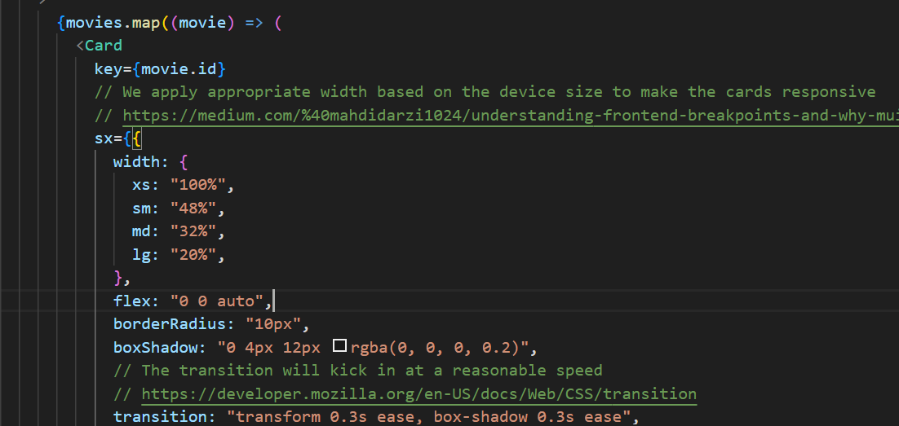

Because we have set thw width to 20% on large screens 'lg', we will be able to see between 4 and more cards on desktop view depending on the size of the screen, but certainly not all 20 ones. Therefore, we needed a way to scroll through and be able to view all 20 cards, and we resolve to use [useRef](https://react.dev/reference/react/useRef):

```
const scrollRef = useRef<HTMLDivElement>(null);

  /**
   * Programmatically scrolls the referenced div left or right by 80% of its visible width.
   * The parameter 'dir' is a string that indicates the direction of the scroll.
   */
  const scroll = (dir: "left" | "right") => {
    /**
     * The '.current' property holds a reference to the actual DOM element, once React assigns it
     */
    if (scrollRef.current) {
      /**
       * Calculate how far to scroll.
       * This uses 95.5% of the current width of the container to create a responsive scroll effect.
       * 'ClientWidth' returns the width of an HTML element including padding in pixels,
       * but does not include margin, border and scrollbar width.
       * https://www.geeksforgeeks.org/css/offsetwidth-clientwidth-scrollwidth-and-height-respectively-in-css/
       */
      const scrollAmount = scrollRef.current.clientWidth * 0.955;

      /**
       * Scroll the container horizontally using scrollBy().
       * If the direction is "left", scroll by a negative value.
       * If the direction is "right", scroll by a positive value.
       * The scroll behavior is set to "smooth" for animated scrolling.
       * https://developer.mozilla.org/en-US/docs/Web/API/Element/scrollBy?
       * https://developer.mozilla.org/en-US/docs/Web/API/Element/scrollBy?#behavior
       */
      scrollRef.current.scrollBy({
        // If dir is left scroll negatively, otherwise positively
        left: dir === "left" ? -scrollAmount : scrollAmount,
        behavior: "smooth",
      });
    }
```

The above lines of code create a reference to a div element using useRef hook, initializing it as null. Once the component mounts, React assigns the actual DOM node to scrollRef.current.
The scroll function is defined to take a direction ("left" or "right") and programmatically scroll the referenced div. It basically calculates how far to scroll based on 95.5% of the container's visible width using clientWidth, ensuring the scroll behavior adapts to different screen sizes.
Finally, it uses scrollBy to move the container horizontally in the specified direction with smooth animation.

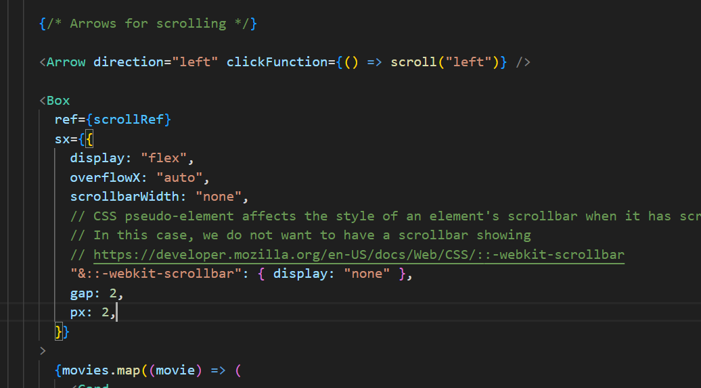

After rendering the left arrow (**arrow/index.tsx**), the code sets up a '<Box>' component that acts as the scrollable container for the movie cards. This Box is connected to 'scrollRef', allowing it to be scrolled using the previously defined 'scroll()' function.

Inside the sx prop, the container is styled with 'display:"flex"' to ensure that its children are horizontally aligned, while 'overflowX: "auto"' enables horizontal scrolling when content overflows the container. scrollbarWidth: "none" hides scrollbars on FireFox, which would really be unpleasant to an aesthetically-sensitive eye, and the &::-webkit-scrollbar rule hides scrollbars in WebKit browsers like Chrome and Safari.

```
...
const [discoverMovies, setDiscoverMovies] = useState<BaseMovieProps[]>([]);
...

// We create a const discover and fetch the movies via the API function
const discover = await getMovies(page, lang);
setDiscoverMovies(discover.results);

...
 <MovieCarouselDiscover
        title={t("discover_movies")}
        movies={discoverMovies}
        onCardClick={function (): void {
          throw new Error("Function not implemented.");
        }}
      />
...

```

At this point, what was left to do was create a useState hook set the discovery movies array, fetch a list of movies for the 'Discover Movies' from the API function 'getMovies(page, lang)' in the **tmdb-api.ts** file, then, store the results array in state using setDiscoverMovies.
This state is, in turn, passed into the <MovieCarouselDiscover /> component as the movies prop.
The 'onCardClick' function is currently a placeholder, but the card itself is clickable and lands the user onto the movie details page.

All of the above logic, of course, can in turn be applied to the upcomingMovies and nowPlaying movies carousels by fetching the respective movie objects via the 'getUpcomingMovies()', and 'getNowPlayingMovies()' in **tmdb-api.ts**.

Finally, a note about the BaseMovieProps interface used in the homePage and throughout the app, which can be found in the **types/interfaces.ts**:

```
export interface BaseMovieProps {
  title: string;
  budget?: number;
  homepage?: string | undefined;
  id: number | string;
  imdb_id?: string;
  original_language?: string;
  overview?: string;
  release_date?: string;
  vote_average?: number;
  popularity?: number;
  poster_path?: string;
  tagline?: string;
  runtime?: number;
  revenue?: number;
  vote_count?: number;
  favourite?: boolean;
  genre_ids?: number[];
}
```

### Arrow

It is noteworthy to take a quick look at the component **arrow/index.tsx**, which defines a reusable Arrow for the above carousel navigation.
It uses Material UI icons 'ChevronLeft' and 'ChevronRight' to visually represent left or right arrows. The component takes two props, which are 'direction' and 'clickFunction':

```
interface ArrowProps {
  direction: "left" | "right";
  clickFunction: () => void;
}
```

Based on the direction, it dynamically selects the appropriate icon.

```
const icon = direction === "left" ? <ChevronLeft /> : <ChevronRight />;

```

It also styles the arrow with absolute positioning, so it appears centered vertically on the container edge (left or right):

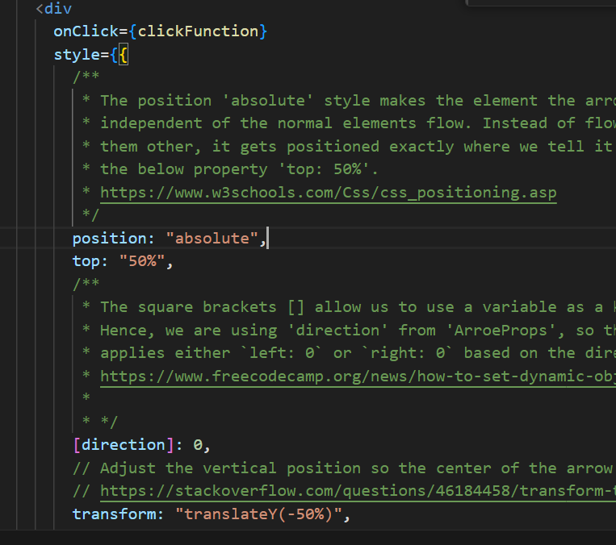

As far as '[direction]: 0' goes, the square brackets [] allow us to use a variable as a key in the object. Hence, we are using 'direction' from 'ArrowProps', so that it dynamicallyapplies either `left: 0` or `right: 0` based on the set direction.

### Source attribution

- https://mui.com/material-ui/api/card-media/
- https://mui.com/material-ui/material-icons/?selected=VideoCameraFront
- https://image.tmdb.org/t/p/w500
- https://mad9022.github.io/W2022/modules/week5/api-fetch/#the-movie-db-review
- https://stackoverflow.com/questions/63842284/autoplay-video-in-react-material-ui-cardmedia-component
- https://www.stornaway.io/youtube-url-parameters-time-autoplay-loop-controls-language-interactive-video/?
- https://stackoverflow.com/questions/13041088/getting-an-embedded-youtube-video-to-auto-play-and-loop?
- https://developers.google.com/youtube/player_parameters?utm_source=chatgpt.com
- https://atomizedobjects.com/blog/react/how-to-use-useref-in-react/
- https://medium.com/@juvitasaini/useref-understand-with-scroll-example-75ad7139557b
- https://tj.ie/scrollable-container-controls-with-react-hooks/?
- https://www.geeksforgeeks.org/css/offsetwidth-clientwidth-scrollwidth-and-height-respectively-in-css/
- https://developer.mozilla.org/en-US/docs/Web/API/Element/scrollBy?
- https://developer.mozilla.org/en-US/docs/Web/API/Element/scrollBy?#behavior
- https://mui.com/material-ui/guides/routing/#link
- https://mui.com/system/getting-started/the-sx-prop/?
- https://medium.com/@mahdidarzi1024/understanding-frontend-breakpoints-and-why-muis-defaults-are-perfectly-fine-04f6f52476cd?
- https://developer.mozilla.org/en-US/docs/Web/CSS/transition
- https://developer.mozilla.org/en-US/docs/Web/CSS/transform-function/scale
- https://developer.mozilla.org/en-US/docs/Web/CSS/::-webkit-scrollbar
- https://react.i18next.com/latest/usetranslation-hook
- https://stackoverflow.com/questions/46160461/how-do-you-set-the-document-title-in-react?
- https://tanstack.com/query/latest/docs/framework/react/guides/paginated-queries?from=reactQueryV3
- https://developer.mozilla.org/en-US/docs/Web/JavaScript/Reference/Global_Objects/Math/floor
- https://developer.mozilla.org/en-US/docs/Web/JavaScript/Reference/Global_Objects/Math/random#examples
- https://dev.to/kanaga_vimala_66acce9cf6e/understanding-mathrandom-mathfloor-and-arrays-in-javascript-mkl
- https://github.com/grantholle/moviedb-promise/blob/main/README.md?
- https://developer.themoviedb.org/reference/movie-videos
- https://www.themoviedb.org/talk/62db7e45ea84c7004fc5a8c7?
- https://tvc.mintlify.app/api-reference/endpoint/movies/videos
- https://www.w3schools.com/Css/css_positioning.asp
- https://www.freecodecamp.org/news/how-to-set-dynamic-object-properties-using-computed-property-names/?
- https://stackoverflow.com/questions/46184458/transform-translate-50-50
- https://daily-dev-tips.com/posts/delay-your-css-animations-to-make-them-cleaner/
- https://blog.karenying.com/posts/adding-transitions-to-a-react-carousel-with-material-ui

## Discover Movies page

This page displays a paginated, filterable list of movies retrieved from the TMDB API getMovies() in the **tmdb-api.ts** file:

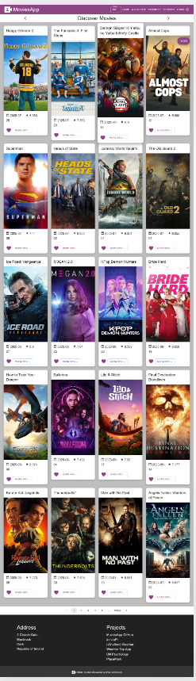

It uses useState hooks to manage local state for pagination and sorting, and useEffect to update the page title based on the selected language. The current language is determined using the useTranslation hook from react-i18next, just like on the rest of the pages:

```
const { i18n } = useTranslation();

const lang = i18n.language || "en-US";

```

The useState(1) hook sets the initial page number to 1 so the first set of movie results is shown by default. The useQuery hook then runs the getMovies() function using the current page, and lang as query parameters. React Query tracks these parameters, and automatically refetches data if either value changes:

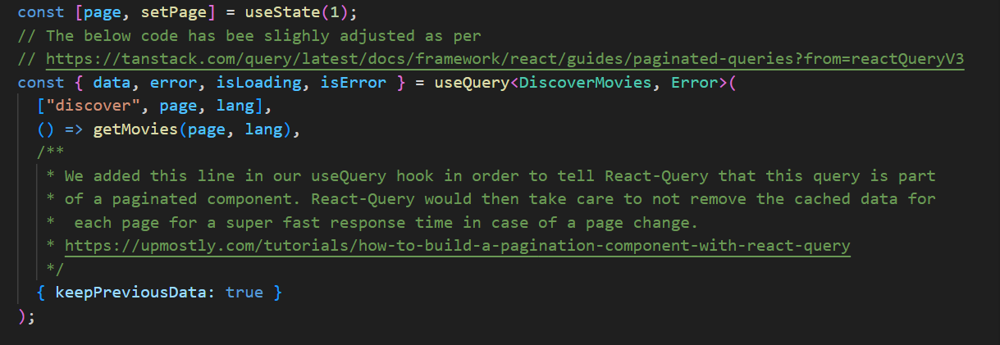

In a nutshell, if the 'page' number, or the 'lang' value change, useQuery will re-fetch the data which will refrsh the page which will display a new set of 20 movies (for instance from page 13 if selected), and movie data in Spanish (if the user switch to ES on the language switcher):

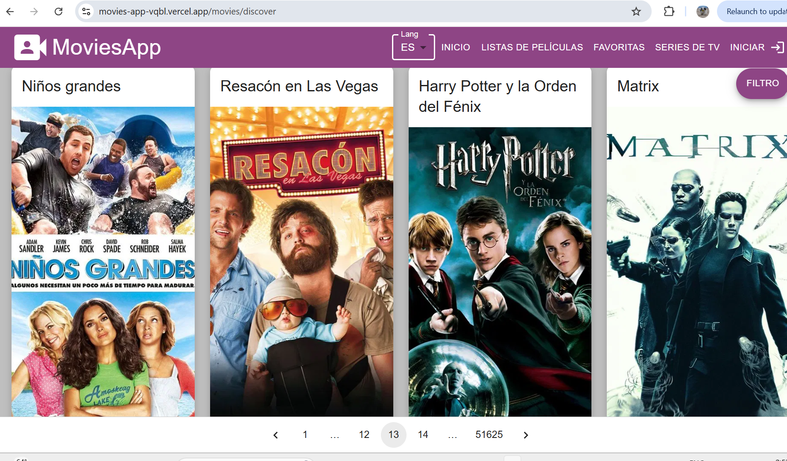

The 'keepPreviousData: true' option ensures that the old page's data is kept visible while the new data loads, making the pagination feel smoother. The response provides data, error, isLoading, and isError to handle loading and error states in the UI.

At the very bottom of the page, we have set up a sticky pagination item, which is nothing more than a Material UI component called 'Pagination, which will render our pagination feature:

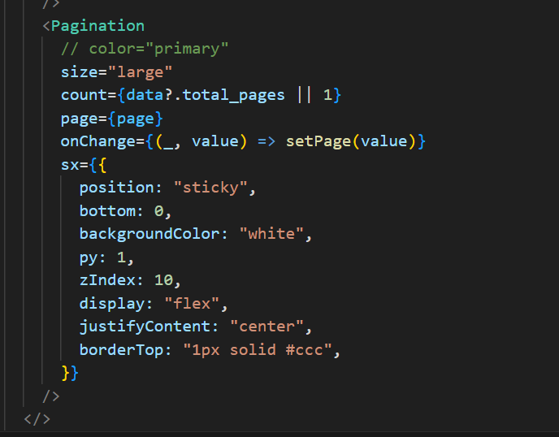

To ensure the retrieval of all pages, we needed to create a new interface DiscoverMovies in **types/interfaces.ts**, which sort of extends the BaseMovieProps to include the below fields:

```
export interface DiscoverMovies {
  page: number;
  total_pages: number;
  total_results: number;
  results: BaseMovieProps[];
}

```

'onChange' listens for a change event, such as when a user clicks a different page number. Then, The event handler receives two arguments:

- the first argument is unused, so it's ignored with \_.
- value is the second argument, representing the selected page number.
  'setPage(value)', hence, updates the state for page, triggering a re-render with the new data on the page.

Finally, the Discover Movies page hinges on a page template component using three main props:

- 'title'
- 'movies' prop provides the list of movies to display, which are already sorted
- 'action' prop, which is a function that takes a movie and returns an 'AddToFavouritesIcon' component for that movie. This allows each movie card to display a button to add it to favourites

```
     <PageTemplate
        // title="Discover Movies"
        title={t("discover_movies")}
        movies={sortedDisplayedMovies}
        // movies={paginatedMovies}
        action={(movie: BaseMovieProps) => {
          return <AddToFavouritesIcon {...movie} />;
        }}
      />
```

The 'filtering' and 'sorting' logic, just like the pagintion one, apply to several pages, and will be discussed in a separate chpater of this README.md document.

However, the next subchapters will briefly hash out the use of the **templateMovieListPage/index.tsx** utilized on the Dicover Movies page, and others.

### Source attribution

- https://mui.com/material-ui/react-pagination/
- https://react.i18next.com/latest/usetranslation-hook
- https://stackoverflow.com/questions/46160461/how-do-you-set-the-document-title-in-react?
- https://tanstack.com/query/latest/docs/framework/react/guides/paginated-queries?from=reactQueryV3
- https://upmostly.com/tutorials/how-to-build-a-pagination-component-with-react-query
- https://developer.mozilla.org/en-US/docs/Web/JavaScript/Reference/Global_Objects/String/localeCompare
- https://developer.mozilla.org/en-US/docs/Web/JavaScript/Reference/Global_Objects/Array/sort
- https://stackoverflow.com/questions/74242074/sorting-array-of-objects-by-iso-date
- https://mui.com/material-ui/react-pagination/#controlled-pagination

### Template Movie List Page

This component (**templateMovieListPage/index.tsx**) is built out as a reusable layout for movie list pages. It receives movies, title, and action as props.
The layout includes a header, which is no longer inside the grid as given at the beginning of the project, and a styled grid container to structure the content.
The 'MovieList' component is nested inside the grid for responsive layout.
Styles are applied via the sx prop to control padding, background, and layout spacing. Paddings and minimum height have been added later to confer a nice, and more elevated touch to the landing pages:

```
const styles = {
  root: {
    backgroundColor: "#bfbfbf",
    paddingRight: "1%",
    paddingLeft: "1%",
    paddingBottom: "2%",
    paddingTop: "1%",
    minHeight: "50vh",
  },
};
```

### Movie List component

The **movieList/index.tsx** component imports the 'movieCard' component and set a grid layout in which the Movie component will iterate and enable the rendering of all movie data fetched from the API function in the **tmdb-api.tsx** consumed on the specific page.
The 'MovieList' functional component, in essence, receives movies and action as props based on the BaseMovieListProps interface. It, then, maps over the movies array, creating a Grid item for each movie, which contains a Movie component.
Finally, it returns the array of movies in the form of movie cards:

```
import React from "react";
import Movie from "../movieCard/";
import Grid from "@mui/material/Grid";
import { BaseMovieListProps } from "../../types/interfaces";

const MovieList: React.FC<BaseMovieListProps> = ({ movies, action }) => {
  const movieCards = movies.map((m) => (
    <Grid key={m.id} item xs={12} sm={6} md={4} lg={3} xl={2}>
      <Movie key={m.id} movie={m} action={action} />
    </Grid>
  ));
  return movieCards;
};

export default MovieList;

```

### Header Movie list

This component in **headerMovieList/index.tsx** has been targeted for minor, and aesthetic changes in terms of padding and text alignment of the title as well as of the color of the arrows, which reflects the chosen style throughout the app:

```
  <ArrowBackIcon sx={{ color: "#8E4585" }} fontSize="large" />
      </IconButton>

      <Typography
        variant="h4"
        component="h3"
        style={{
          paddingLeft: "2%",
          paddingRight: "2%",
          textAlign: "center",
        }}
      >
        {title}
      </Typography>
      <IconButton aria-label="go forward">
        <ArrowForwardIcon sx={{ color: "#8E4585" }} fontSize="large" />
      </IconButton>
```

This component is a great example of a reusable UI piece since it is completely independent of whether we use it for movies or TV series.

The internal prop

```
interface HeaderProps {
  title: string;
}
```

ensures that the component is decoupled and reusable throghout the app.

### Movie card

The **movieCard/index.tsx** component imports essential React hooks like useContext, useEffect, and useState to manage local state, and access global context values.
It also uses components like Card, CardHeader, and CardMedia to create a responsive and interactive movie card layout.
Just like the pages and most of the components, useTranslation() hook from react-i18next allows the component to support multiple languages and dynamic translation.

The below React hook uses the useContext hook to access values provided by the 'MoviesContext', which stores shared state across components, such as the list of favourite movies and the must-watch list.

```
  const { favourites, mustWatchList } = useContext(MoviesContext);
```

By destructuring 'favourites', and 'mustWatchList', the component can directly use these arrays.
If we drill down on the arrays, we find out that 'favourites' holds an array of movie IDs that the user has marked as favourites, by simply clicking on the 'favourite' icon ('<FavoriteIcon />').

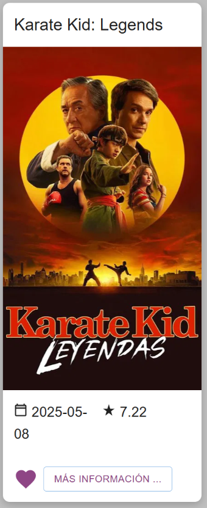

This holds true on the 'Discover Movies page at least since, as far as the 'upcomingMovies' and 'nowPlaying', we have actually opted for the use of the 'mustWatch' icon only.

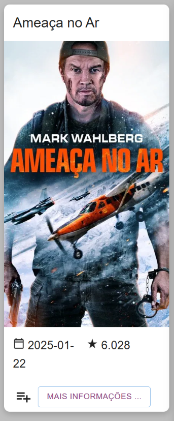

When it comes to the 'mustWatch', this is instead an object that the user chooses.
Therefore, for React to be able to check whether a movie is in the 'favourite' or/and in the 'mustWatch' list, we need to use 2 different methods:

```
  const isFavourite = favourites.includes(Number(movie.id));

  const isInMustWatchList = mustWatchList.some((m) => m.id === movie.id);
```

As far as 'favourites', we use includes(), which is a function that checks whether the current movie id exists in the favourite list, which is an array of movies IDs.
'mustWatch' wise, we use some(), which checks if at least one element in an array meets a condition, and returns true or false. We do it by iterating through the list of movie objects.

However, since a movie might be included in more than one list, there might be the case that we will be able to see a movie tagged for both 'favourites' and mustWatch' list.

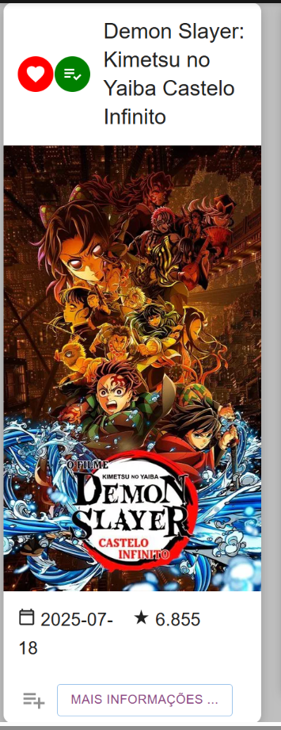

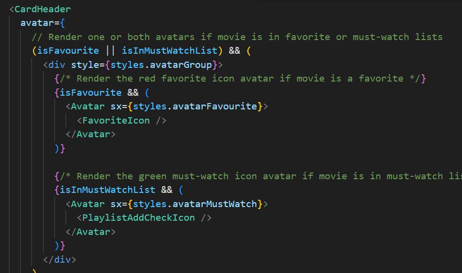

Additionally, the card will show icons to add a movie review for the favourite movies,

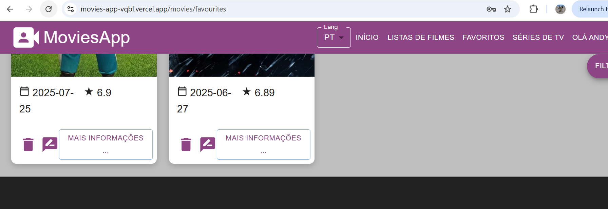

but also for the mustWatch movies:

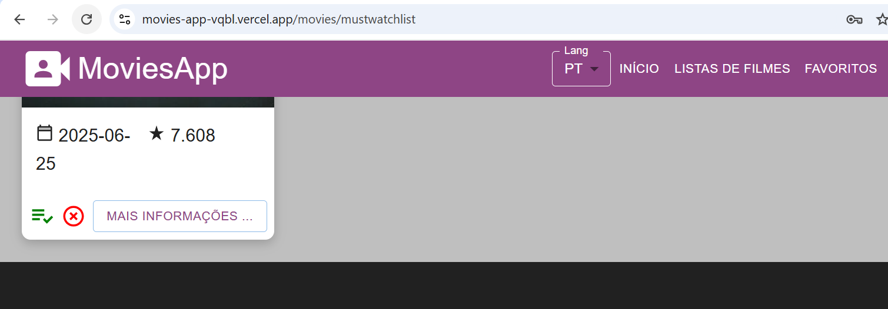

mustWatchList contains full movie objects that the user has added to their must-watch queue.

'MoviesContext' provides access to lists like favourites and mustWatchList, letting the card conditionally show icons using includes() and some(), as above-metioned.
Movie details like title, poster, release date, and rating are displayed dynamically, and clicking the action button or link navigates to a detailed movie page.

An interesting feature we have added to spice up our card rendering has been some changes we have made on the CSS front:

```
...
const styles = {
  card: {
    maxWidth: 345, // Card width to keep layout consistent in grid
    borderRadius: "10px",
    boxShadow: "0 4px 12px rgba(0, 0, 0, 0.2)",
    // The transition will kick in at a reasonable speed
    // https://developer.mozilla.org/en-US/docs/Web/CSS/transition
    transition: "transform 0.3s ease, box-shadow 0.3s ease",
    "&:hover": {
      // The scale() CSS function defines a transformation that resizes an element on the 2D plane.
      // https://developer.mozilla.org/en-US/docs/Web/CSS/transform-function/scale
      transform: "scale(1.05)",
      // we change the box Shadow property values to make it more prominent on hovering
      boxShadow: "0 8px 20px rgba(0, 0, 0, 0.3)",
      // This property will make the card stick out with a sort of the 3D effect
      cursor: "pointer",
    },
  },

  ...

```

Apart from the borderRadius, and boxShadow properties which help make the card 'stick out' even more, we have added the transition, and transform properties on hover to make the card kinda 'bulge out':

[Watch the video](./20250727-1608-40.3287147.mp4)

### Source attribution

- https://developer.mozilla.org/en-US/docs/Web/CSS/transition
- https://developer.mozilla.org/en-US/docs/Web/CSS/transform-function/scale
- https://react.i18next.com/latest/usetranslation-hook
- https://developer.mozilla.org/en-US/docs/Web/JavaScript/Reference/Global_Objects/Array/includes
- https://developer.mozilla.org/en-US/docs/Web/JavaScript/Reference/Global_Objects/Array/some

## Upcoming Movies page

The **upcomingMoviesPage.tsx** page displays upcoming movies with filtering, sorting, and pagination, just like the 'Discover Movies' page. It uses the same template **templateMovieListPage/index.tsx** as well.
It uses useContext hook to access the 'must watch' movie list

```
// Access the mustWatchList and addToMustWatchList function from context
  const { addToMustWatchList, mustWatchList } = useContext(MoviesContext);
```

and a custom filtering hook to apply filters like title, genre, and release year, just like all the rest of the pages (we will get deep into it later with a dedicated chapter).

The useQuery hook from React Query fetches movie data from the TMDB API below in **tmdb-api.ts**:

```
export const getUpcomingMovies = (page: number, language = "en-US") => {
  return fetch(
    `https://api.themoviedb.org/3/movie/upcoming?api_key=${
      import.meta.env.VITE_TMDB_KEY
    }&language=${language}&page=${page}`
  )
    .then((response) => {
      if (!response.ok)
        throw new Error(
          `Unable to fetch movies. Response status: ${response.status}`
        );
      return response.json();
    })
    .catch((error) => {
      throw error;
    });
};
```

and manages loading and error states.

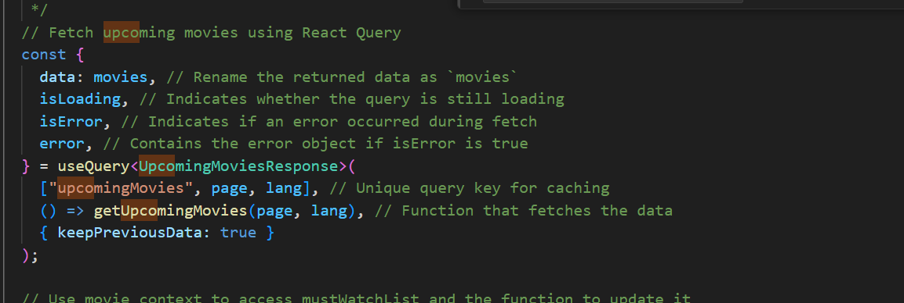

As it can be observed above, the interface props we are leveraging is 'UpcomingMoviesResponse' in **types/interfaces.ts** which does encompass fields such as 'total_pages' and 'page', which are essential for pagination purposes, as we have seen in the 'Discover Movies' page too:

```
export interface UpcomingMoviesResponse {
  page: number;
  total_pages: number;
  results: BaseMovieProps[];
}
```

The 'lang' variable conveys 'i18n.language', which is the language selected in the language switcher by the user, which will dtermine the language of the data fetched by the getUpcomingMovies() API function.

The biggest difference between this file and **discoverPage.tsx** is that we have not created a component ad hoc to add to must watch list as **cardIcons/addToFavourites.tsx**.
This means that we are managing the logic of adding the movie to the 'must watch' list straight into the 'Upcoming Movies' page itself:

```
...

 <PageTemplate
        // title="Upcoming Movies"
        title={t("upcoming_movies")}
        /**
         * It passes the list of movies to display.
         * If movies is truthy (i.e., data has been loaded and is available),
         * it will be passed as-is. If movies is falsy
         * (i.e., still undefined or null during loading),
         * then it will pass an empty array [] instead.
         */
        movies={sortedDisplayedMovies} // Show filtered list
        action={(movie: BaseMovieProps) => {
          // Check if the movie is already in the must-watch list
          const isInMustWatch = mustWatchList.some((m) => m.id === movie.id);

          console.log("Sort Order:", sortOrder);

          // Add the movie to the must-watch list if not already there
          const handleClick = () => {
            if (!isInMustWatch) {
              addToMustWatchList(movie);
            }
          };

          return (
            <>
              {/* Overlay green icon if movie is already in must-watch list */}
              {isInMustWatch && (
                <div
                  style={{
                    position: "absolute",
                    top: 8,
                    right: 8,
                    zIndex: 10,
                  }}
                >
                  <PlaylistAddIcon
                    style={{
                      fontSize: 28,
                      color: "green",
                    }}
                  />
                </div>
              )}

              {/* Add-to-must-watch icon (greyed out if already added) */}
              <PlaylistAddIcon
                style={{
                  marginLeft: "4%",
                  marginRight: "4%",
                  verticalAlign: "middle",
                  fontSize: "30px",
                  cursor: isInMustWatch ? "default" : "pointer",
                  opacity: isInMustWatch ? 0.5 : 1,
                }}
                onClick={handleClick}
              />
            </>
          );
        }}
      />

...

```

We could have definitely pursued the same route as for 'favourites', but we left the code as is now for illustrative purposes.

### Source attribution

- https://mui.com/material-ui/react-pagination/
- https://react.i18next.com/latest/usetranslation-hook
- https://stackoverflow.com/questions/46160461/how-do-you-set-the-document-title-in-react?
- https://tanstack.com/query/latest/docs/framework/react/guides/paginated-queries?from=reactQueryV3
- https://developer.mozilla.org/en-US/docs/Web/JavaScript/Reference/Global_Objects/String/localeCompare
- https://developer.mozilla.org/en-US/docs/Web/JavaScript/Reference/Global_Objects/Array/sort
- https://stackoverflow.com/questions/74242074/sorting-array-of-objects-by-iso-date?

### Add to favourites

The **cardIcons/addToFavourites.tsx** component accesses the 'MoviesContext' to use the addToFavourites() function.

```
...
 const onUserSelect = (e: MouseEvent<HTMLButtonElement>) => {
    e.preventDefault();
    context.addToFavourites(movie);
  };
...
```

When the user clicks the icon **favouriteMoviesPage.tsx**, it triggers 'onUserSelect', which adds the movie to favorites.
The component renders a styled FavoriteIcon inside an IconButton, and uses BaseMovieProps as props to ensure the movie data fetching.
The only change made in here has been the color of the icon itself:

```
  <FavoriteIcon
        //  color="inherit"
        sx={{ color: "#8E4585" }}
        fontSize="large"
      />
```

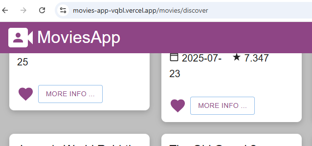

### Remove from favourites

The **cardIcons/removeFromFavourites.tsx** component accesses the 'MoviesContext' to use the removeFromFavourites() function.

```
...
  const onUserRequest = (e: MouseEvent<HTMLButtonElement>) => {
    e.preventDefault();
    context.removeFromFavourites(movie);
  };
...
```

When the user clicks the delete icon in the **favouriteMoviesPage.tsx**, it triggers 'onUserSelect', which removes the movie from 'favourites'.
The component renders a styled DeleteIcon inside an IconButton, and uses BaseMovieProps as props to ensure the movie data removal.
The only change made in here has been the color of the icon itself:

```
  <IconButton aria-label="remove from favorites" onClick={onUserRequest}>
      <DeleteIcon sx={{ color: "#8E4585" }} fontSize="large" />
    </IconButton>
```

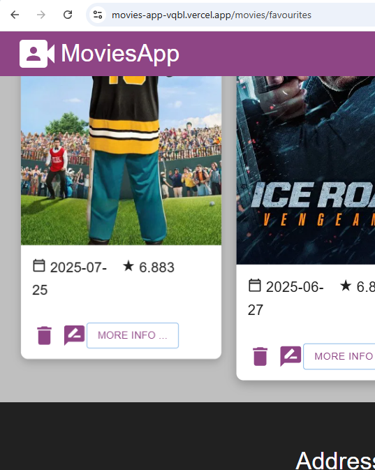

### Remove from must Watch list

The **cardIcons/removeFromMustWatchList.tsx** component accesses the 'MoviesContext' to use the removeFromFavourites() function.

```
...
    const onUserRequest = (e: MouseEvent<HTMLButtonElement>) => {
    e.preventDefault();
    console.log("Remove clicked for:", movie.id);
    context.removeFromMustWatchList(movie);
  };
...
```

When the user clicks the delete icon in the **mustWatchList.tsx**, it triggers 'onUserSelect', which removes the movie from 'must watch' list.
The component renders a styled HighlightOffIcon inside an IconButton, and uses BaseMovieProps as props to ensure the movie data removal.

```
 <IconButton
      aria-label="remove from Must Watch List"
      onClick={onUserRequest}
      style={{ paddingRight: 8 }}
    >
      <HighlightOffIcon
        style={{
          fontSize: "28px",
          color: "red",
        }}
      />
    </IconButton>
```

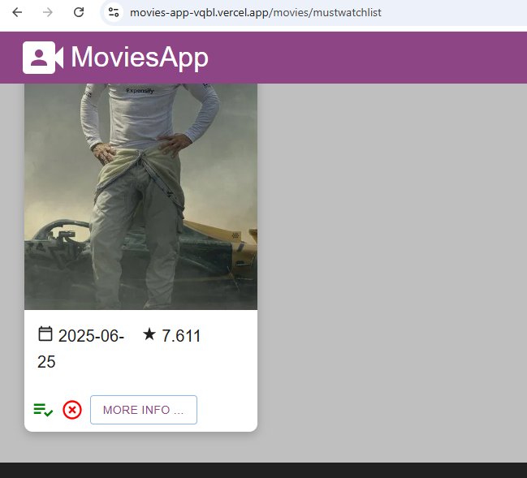

## Now Playing page

The **nowPlayingMoviesPage.tsx** displays 'now playing' movies using the TMDB's API getNowPlayingMovies() in **tmdb-api.ts** with filtering, sorting, and pagination, just like the 'Discover Movies' page. It uses the same template **templateMovieListPage/index.tsx** as well.
It uses useContext hook to access the 'must watch' movie list

```
...
 // Access the mustWatchList and addToMustWatchList function from context
  const { addToMustWatchList, mustWatchList } = useContext(MoviesContext);
...
```

and a custom filtering hook to apply filters like title, genre, and release year, just like all the rest of the pages (we will get deep into it later with a dedicated chapter).

The useQuery hook from React Query fetches movie data from the TMDB API below in **tmdb-api.ts**:

```
...

/**
 * Fetches the list of movies that are now playing in theaters.
 * https://developer.themoviedb.org/reference/movie-now-playing-list
 */
export const getNowPlayingMovies = (page: number, language = "en-US") => {
  return fetch(
    `https://api.themoviedb.org/3/movie/now_playing?api_key=${
      import.meta.env.VITE_TMDB_KEY
    }&language=${language}&page=${page}`
  )
    .then((response) => {
      if (!response.ok)
        throw new Error(
          `Unable to fetch movies. Response status: ${response.status}`
        );
      return response.json();
    })
    .catch((error) => {
      throw error;
    });
};
...
```

and manages loading and error states.

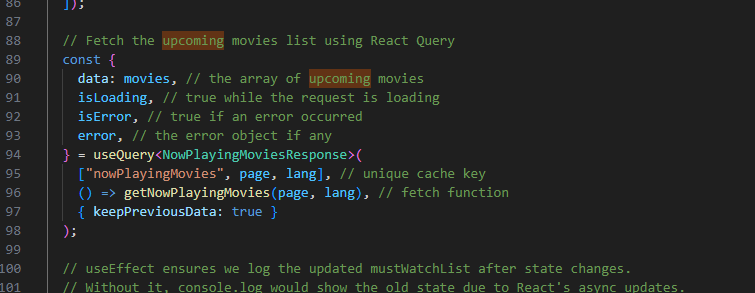

As it can be observed above, the interface props we are leveraging is 'NowPlayingMoviesResponse' in **types/interfaces.ts** which does encompass fields such as 'total_pages' and 'page', which are essential for pagination purposes, as we have seen in the 'Discover Movies' page too:

```
export interface NowPlayingMoviesResponse {
  page: number;
  total_pages: number;
  results: BaseMovieProps[];
}
```

The 'lang' variable conveys 'i18n.language', which is the language selected in the language switcher by the user, which will determine the language of the data fetched by the getUpcomingMovies() API function.

The rest of the code structure of this page is very similar to the 'upcoming movie' page indeed.

### Source attribution

- https://mui.com/material-ui/react-pagination/
- https://react.i18next.com/latest/usetranslation-hook
- https://stackoverflow.com/questions/46160461/how-do-you-set-the-document-title-in-react
- https://tanstack.com/query/latest/docs/framework/react/guides/paginated-queries?from=reactQueryV3
- https://developer.mozilla.org/en-US/docs/Web/JavaScript/Reference/Global_Objects/String/localeCompare
- https://developer.mozilla.org/en-US/docs/Web/JavaScript/Reference/Global_Objects/Array/sort
- https://stackoverflow.com/questions/74242074/sorting-array-of-objects-by-iso-date

## Must Watch List page

The **mustWatchList.tsx** page displays a personalized list of must-watch movies. It retrieves the list from both TMDB APIs getUpcomingMovies() and getNowPlayingMovies() in the **tmdb-api.ts** file when a user click on the 'PlaylistAddIcon'. At that point, the above-mentioned icon will display right on top of the clicked card,

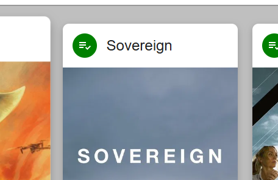

(example from the Movie card that shows the code to dispaly the icon on the card header)

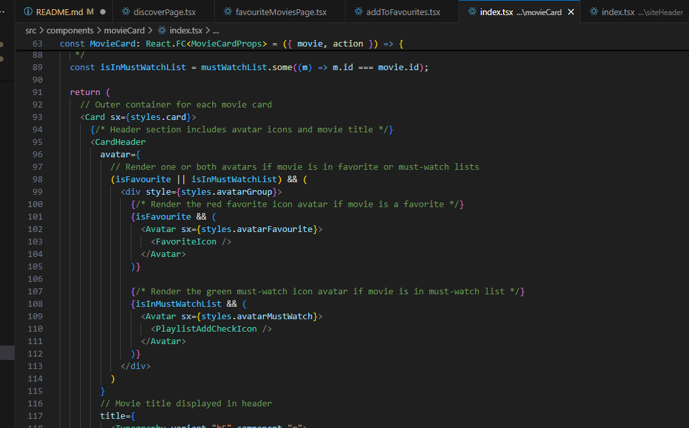

which will, then, be displaying on the 'Movie Watch List' page (the logic that handles the addition or removal of a movie from a list is handled by the **context/moviesContext.tsx** file and will be discussed in a dedicated chapter.):

```
 // Access global must-watch list and remove function from context
  const { mustWatchList } = useContext(MoviesContext);
```

The page uses a useEffect hook to fetch the translated movie details whenever the language or must-watch list change. To achieve that, we first create a localizedList state hook, just like the one below, which is set to as an empty array:

```
const [localizedList, setLocalizedList] = useState<BaseMovieProps[]>([]);
```

This variable will eventually hold a list of movies, each updated with the correct language based upon the one selected by the user. The reason for this is that the original mustWatchList comes from 'moviesContext', and contains movies in the language they were originally from the 'Upcoming Movies' or from the 'Now Playing' page. However, if the user changes the language later, those movies will not automatically get translated, so we need a separate localized copy.

Additionally, the boolean state hook is called loading to keep track of whether data is being fetched:

```
 const [loading, setLoading] = useState(true);
```

Therefore, the useEffect hook runs every time the 'mustWatchList' or the selected language changes.
Inside this hook, an asynchronous function called 'fetchLocalized' will be responsible for updating each movie in the list with its translated data:

```
...
useEffect(() => {
    /**
     * Define an async function to fetch localized data for each movie in the mustWatch list.
     */
    const fetchLocalized = async () => {
      /**
       * Create an array to hold the updated movie objects
       */
      const updated = [];
      /**
       * This executes a loop that operates on a sequence of values sourced from an iterable object,
       * which in this case the iterable object is 'mustWatchList', whose variable is 'movie'
       * https://developer.mozilla.org/en-US/docs/Web/JavaScript/Reference/Statements/for...of
       */
      for (const movie of mustWatchList) {
        /**
         * Call the getMovie() API to get full movie data as localized.
         * This includes translated title, overview, poster, etc.
         */
        const data = await getMovie(movie.id, lang);
        /**
         * Push the new movie object to the array
         * localizedList
         */
        updated.push({
          /**
           * ...movie is the 'spreaded' to copy all existing data of the movie object.
           * After spreading, we can add or overwrite specific properties, like title, overview, poster path,
           * release date, and vote average with new translated values.
           * It creates a new object that keeps all old data except the ones we explicitly change.
           */
          ...movie,
          title: data.title,
          overview: data.overview,
          poster_path: data.poster_path,
          release_date: data.release_date,
          vote_average: data.vote_average,
          /**
           * If the movie only has `genres` (array of { id, name }),
           * extract the numeric genre_ids using optional chaining.
           * If `genres` is missing or not an array, default to an empty array.
           */
          genre_ids: data.genres?.map((g: { id: number }) => g.id) || [],
        });
      }
      /**
       * Save the updated list of localized movie data to state,
       * so the UI can render it with the correct language.
       */
      setLocalizedList(updated);
      setLoading(false); // Mark as finished loading
    };
    ...
```

The empty array 'updated' will store the new localized movie objects.
The function then loops through each movie in mustWatchList using a 'for...of' loop, and, for every movie, it calls the getMovie API, which fetches the full movie data in the current language.

```
 const data = await getMovie(movie.id, lang);
```

Once the data is returned, a new object is created by spreading the original movie’s data, and overriding specific fields like 'title', 'overview', 'poster_path', 'release_date', and 'vote_average' with their localized versions (in-language version).

Additionally, if the fetched data includes a list of genres, the function extracts just the genre , and stores them in the 'genre_ids' property. If genres are missing, an empty array is used instead.

Each newly created movie object is added/pushed to the updated array, so that, in the end, once all movies have been added, the 'setLocalizedList' function is called with the updated array to store the new state.
Last but not least, the setLoading(false) kicks in to indicate that the data fetching is complete, and the component can be re-rendered.

See example of the page in Portuguese:

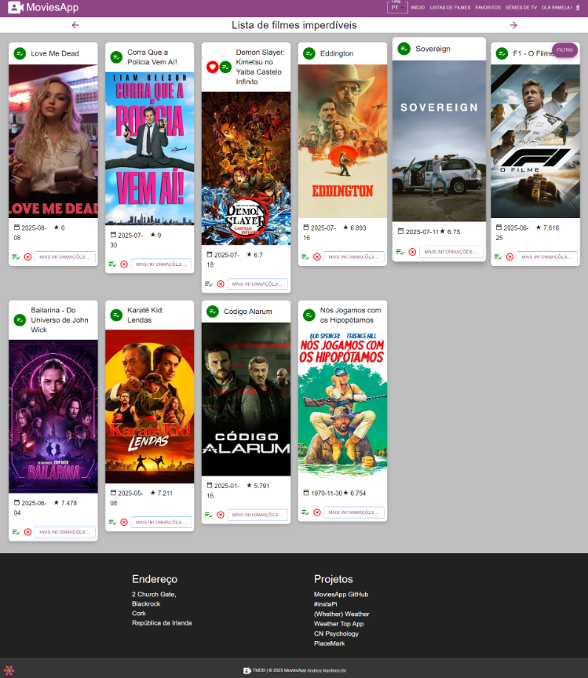

### Source attribution

- https://materialui.co/icon/highlight-off
- https://react.i18next.com/latest/usetranslation-hook
- https://stackoverflow.com/questions/46160461/how-do-you-set-the-document-title-in-react
- https://developer.mozilla.org/en-US/docs/Web/JavaScript/Reference/Statements/for...of
- https://developer.mozilla.org/en-US/docs/Web/JavaScript/Reference/Global_Objects/String/localeCompare
- https://developer.mozilla.org/en-US/docs/Web/JavaScript/Reference/Global_Objects/Array/sort
- https://stackoverflow.com/questions/74242074/sorting-array-of-objects-by-iso-date?

## Favourites page

The **favouriteMoviesPage.tsx** displays a personalized list of favourites movies. It retrieves the list from both TMDB APIs getMovies() in the **tmdb-api.ts** file when a user click on the 'FavoriteIcon' on a movie card in the 'Discover Movies' page. At that point, the above-mentioned icon will display right on top of the clicked card,

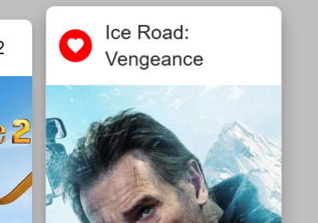

(example from the Movie card that shows the code to dispaly the icon on the card header)


The useContext hook accesses the favourites array from the global MoviesContext, which contains only the movie IDs:

```
  const { favourites: movieIds } = useContext(MoviesContext);
```

To get full movie details in the right language, it uses useQueries from React Query to send API requests using getMovie(movieId, lang):

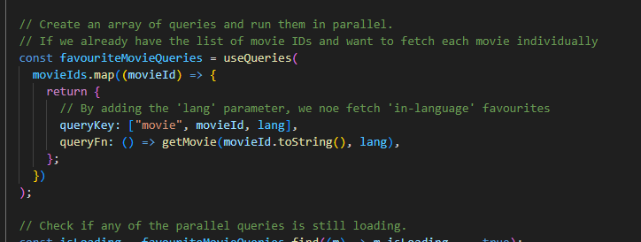

Once the queries are completed, the results are mapped into 'allFavourites':

```
  /**
   * Extract all movie data from the array of favourite queries.
   * Each element is the `data` field from a React Query result object.
   */
  const allFavourites = favouriteMovieQueries.map((q) => q.data);
```

Each movie is then, 'normalized', so that all have a consistent 'genre_ids' format, just like for fields such as 'homepage', 'release_date', poster_path', and so on, which is not the case when we fetch a movie data via the getMovie() API:

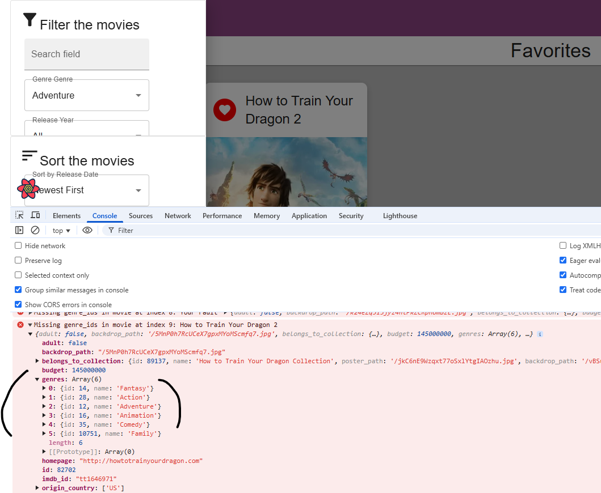

We, hence, resolved working on the below block of code to 'normalize' each single movie data structure to include 'genre_ids' if it did exist:

```
...

  /**
   * Normalize all favourite movies into a consistent structure.
   * This ensures that each movie has `genre_ids`, even if originally only `genres` was provided,
   * and filters out any 'null/undefined' entries.
   */
  const normalizedMovies = allFavourites
    .map((movie) => {
      if (!movie) return null;

      // If genre_ids already exist, return movie as is
      if (movie.genre_ids) {
        return movie;
      }

      /**
       * If the movie only has `genres` (array of { id, name }),
       * extract the numeric genre_ids using optional chaining.
       * If `genres` is missing or not an array, default to an empty array.
       * https://developer.mozilla.org/en-US/docs/Web/JavaScript/Reference/Operators/Optional_chaining
       */
      const genre_ids = movie.genres?.map((g: { id: number }) => g.id) ?? [];

      // Return a new movie object with genre_ids added
      return {
        ...movie,
        genre_ids,
      };
    })
    .filter(Boolean); // remove any null entries safely
  /**
   * PS* Boolean values are typically used in conditional testing, such as the condition for if...else and while statements,
   * the conditional operator (? :), or the predicate return value of Array.prototype.filter().
   * You would rarely need to explicitly convert something to a boolean value, as JavaScript does this automatically in
   * boolean contexts, so you can use any value as if it's a boolean, based on its truthiness.
   * https://developer.mozilla.org/en-US/docs/Web/JavaScript/Reference/Global_Objects/Boolean
   */

  // Apply filters (title, genre, release year) to the normalized movie list.
  const displayedMovies = normalizedMovies
    ? filterFunction(normalizedMovies)
    : [];

...
```

Therere, what we needed to do was to 'map' 'allFavourites' movies, and only return movies with the field 'genre_ids', whereas for those which didn't we 'manipulated' them by returning a new movie object (using the 'spread' operator and adding the genre_ids previously 'mapped' from 'movie.genres'). The 'filter(Boolean)' would then do away with null entries.

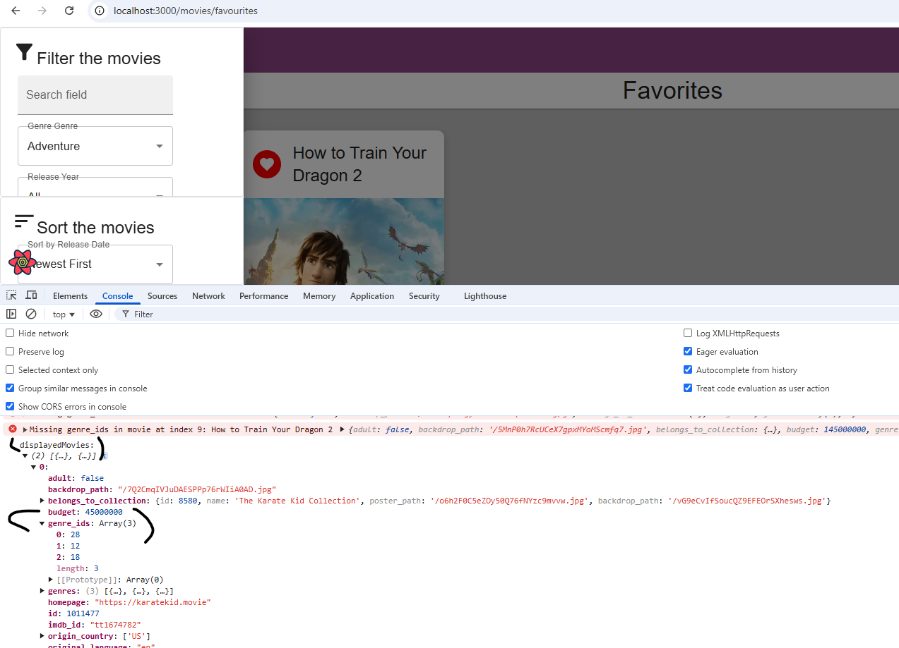

This block of code was necessary because the TMDB API returns different data structures depending on how movie data is fetched, and your app expects a consistent structure (genre_ids) for filtering and displaying movies.

Inside the action prop of PageTemplate, each movie card is rendered with two interactive buttons: RemoveFromFavourites and WriteReview, allowing users to manage their list or write a review.

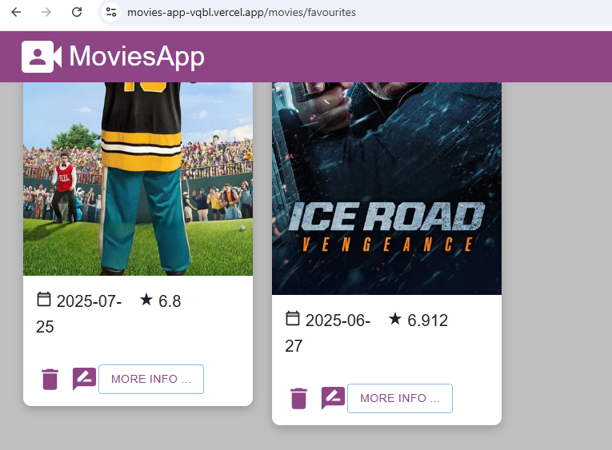

(Code snippet below)

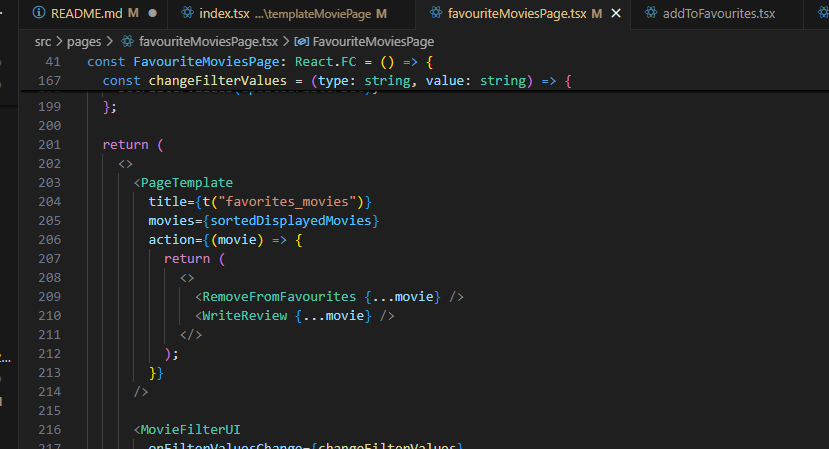

The entire component rerenders whenever the favourites list or selected language changes, ensuring the data remains current and correctly translated.

### Source attribution

- https://react.i18next.com/latest/usetranslation-hook
- https://stackoverflow.com/questions/46160461/how-do-you-set-the-document-title-in-react
- https://developer.mozilla.org/en-US/docs/Web/JavaScript/Reference/Operators/Optional_chaining
- https://developer.mozilla.org/en-US/docs/Web/JavaScript/Reference/Global_Objects/Boolean
- https://developer.mozilla.org/en-US/docs/Web/JavaScript/Reference/Global_Objects/String/localeCompare
- https://developer.mozilla.org/en-US/docs/Web/JavaScript/Reference/Global_Objects/Array/sort
- https://stackoverflow.com/questions/74242074/sorting-array-of-objects-by-iso-date

### Template TV Series list

This component **templateMovieListPage/index.tsx** has been created as a copy of the 'templateMovieListPage', and adapted for TV series,
in order to be used with the 'series' array in place of the 'movies' array.
As a matter of fact, 'series' is fetched from the 'TVSeriesListPageTemplateProps' interface 'series: BaseTVSeriesProps[];' in the **types/interfaces.ts**.
The TVSeriesList component is nested inside the grid for responsive layout.
Styles are applied via the sx prop to control padding, background, and layout spacing. Paddings and minimum height have been added later to confer a nice, and more elevated touch to the landing pages:

```
const styles = {
  root: {
    backgroundColor: "#bfbfbf",
    paddingRight: "1%",
    paddingLeft: "1%",
    paddingBottom: "2%",
    paddingTop: "1%",
    minHeight: "50vh",
  },
};
```

### TV Series List component

The **TVSeriesList/index.tsx** component is a clone of the **movieList/index.tsx** imports the 'movieCard' component, and set a grid layout in which the TVSeriesCard component will iterate and enable the rendering of all TV series data fetched from the API function in the **tmdb-api.tsx** consumed on the specific page.
The 'TVSeriesList' functional component, in essence, receive TVSeries and action as props based on the 'TVSeriesListProps' interface. It, then, maps over the 'series' array, creating a Grid item for each TV Series, which contains a 'TVSeries Card' component.
Finally, it returns the array of series in the form of TVSeries cards:

```
import React from "react";
import Grid from "@mui/material/Grid";
import { TVSeriesListProps } from "../../types/interfaces";
import TVSeriesCard from "../tvSeriesCard";

// 'series' is fetched from the TVSeriesListProps interface 'series: BaseTVSeriesProps[];'
const TVSeriesList: React.FC<TVSeriesListProps> = ({ series, action }) => {
  const seriesCards = series.map((tv) => (
    <Grid key={tv.id} item xs={12} sm={6} md={4} lg={3} xl={2}>
      <TVSeriesCard series={tv} action={action} />
    </Grid>
  ));
  return seriesCards;
};

export default TVSeriesList;

```

### Source attribution

### TV Series card

The **TVSeriesCard/index.tsx** does not use React hooks like useContext, useEffect, and useState to manage local state, and access global context values, as opposed to its clone **movieCard/index.tsx** since we have decided not to implement any 'favourites' or 'mustWatch' features for the TV Series list.

However, it also uses components like Card, CardHeader, and CardMedia to create a responsive and interactive movie card layout.
Just like the pages and most of the components, useTranslation() hook from react-i18next allows the component to support multiple languages and dynamic translation.

The TVSeries card does have the same CSS features as added to the 'Movie card' to spice up the card rendering:

```
...
cconst styles = {
  card: {
    maxWidth: 345, // Card width to keep layout consistent in grid
    borderRadius: "10px",
    boxShadow: "0 4px 12px rgba(0, 0, 0, 0.2)",
    // The transition will kick in at a reasonable speed
    // https://developer.mozilla.org/en-US/docs/Web/CSS/transition
    transition: "transform 0.3s ease, box-shadow 0.3s ease",
    "&:hover": {
      // The scale() CSS function defines a transformation that resizes an element on the 2D plane.
      // https://developer.mozilla.org/en-US/docs/Web/CSS/transform-function/scale
      transform: "scale(1.05)",
      // we change the box Shadow property values to make it more prominent on hovering
      boxShadow: "0 8px 20px rgba(0, 0, 0, 0.3)",
      // This property will make the card stick out with a sort of the 3D effect
      cursor: "pointer",
    },
  },

  ...

```

Apart from the borderRadius, and boxShadow properties which help make the card 'stick out' even more, we have added the transition, and transform properties on hover to make the card kinda 'bulge out':

[Watch the video](./20250729-1442-05.9377567.mp4)

### Source attribution

- https://developer.mozilla.org/en-US/docs/Web/CSS/transition
- https://developer.mozilla.org/en-US/docs/Web/CSS/transform-function/scale
- https://react.i18next.com/latest/usetranslation-hook
- https://developer.mozilla.org/en-US/docs/Web/JavaScript/Reference/Global_Objects/Date/toLocaleDateString
- https://image.tmdb.org/t/p/w500

## Movie Details page

At the core, the **movieDetailsPage.tsx** page serves to fetch and render full details about a single movie, including its cast.

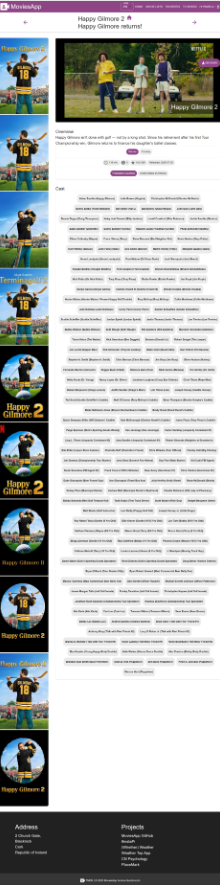
The most critical part of the logic hinges on using 'useParams' to extract the movie ID from the route:

```
const { id } = useParams();
```

This ID becomes the anchor point for the rest of the data fetching flow. Without it, we woud not be able to fetch data of a specific movie when we click on the 'More Info' button on the movie card since the ID is passed to both API functions; getMovie(), and getMovieCredits().

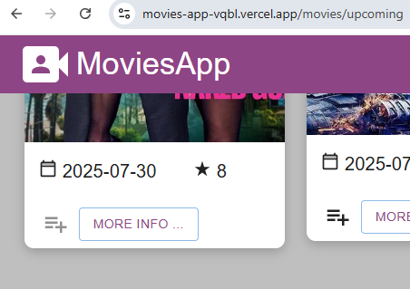

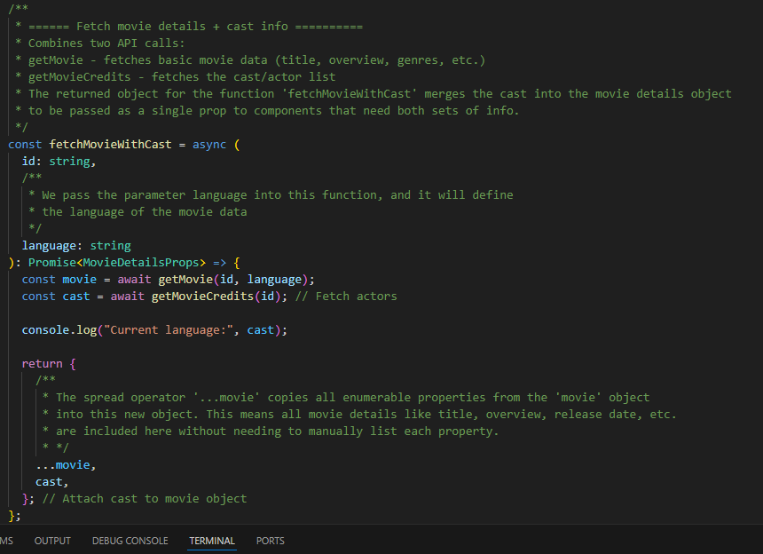

As a matter of fact, we have created an async function 'fetchMovieWithCast' which bundles the two API calls we will use to fetch the movie details, and the movie credits (cast). The spread operator on the movie object then copies all movie properties/fields to this a one, as per the 'MovieDeatilsProps' in **types/interfaces.ts**, and will attach the cast list:

```
export interface MovieDetailsProps extends BaseMovieProps {
  genres: {
    id: number;
    name: string;
  }[];
  production_countries: {
    iso_3166_1: string;
    name: string;
  }[];
  /**
   * List of cast members associated with the movie.
   * We want to make the cast data available wherever we use the MovieDetailsProps —
   * especially in components like TemplateMoviePage or detail views
   * */
  cast: CastMember[];
  /**
   * List of movie release years.
   * https://developers.themoviedb.org/3/movies/get-movie-details
   */
  release: {
    year: number;
  }[];
}

```

The API functions fetching data from the TMDB database are stored into the **tmdb-api.tsx** file:

```
/**
 * Fetches detailed information about a specific movie from TMDb.
 * The 'Language' string is used for localized results and its default is "en-US".
 * https://developer.themoviedb.org/reference/movie-details
 * https://www.themoviedb.org/talk/593fed45c3a36851f8002d83
 */
export const getMovie = (id: string | number, language = "en-US") => {
  return fetch(
    `https://api.themoviedb.org/3/movie/${id}?api_key=${
      import.meta.env.VITE_TMDB_KEY
    }&language=${language}`
  )
    .then((response) => {
      if (!response.ok) {
        throw new Error(
          `Failed to get movie data. Response status: ${response.status}`
        );
      }
      return response.json();
    })
    .catch((error) => {
      throw error;
    });
};
```

```
/**
 * Fetches the cast (actors) for a given movie ID from The Movie Database (TMDb) API.
 * https://developer.themoviedb.org/reference/movie-credits
 * 'id' is the ID of the movie (can be a string or number)
 */
export const getMovieCredits = (id: string | number) => {
  // , language = "en-US")
  return fetch(
    `https://api.themoviedb.org/3/movie/${id}/credits?api_key=${
      import.meta.env.VITE_TMDB_KEY
    }`
  )
    .then((res) => {
      if (!res.ok) throw new Error("Failed to fetch movie credits");
      return res.json();
    })
    .then((json) => json.cast) // Only return the cast (actors)
    .catch((error) => {
      throw error;
    });
};
```

We then run the actual query using React Query’s useQuery:

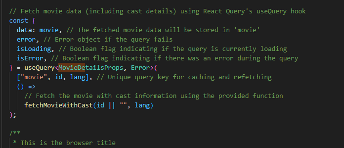

The query key ["movie", id, lang] is not just an ID label. It’s how React Query decides whether cached data is still valid. Including lang ensures that switching languages triggers a refetch. This is the useQuery structure we have used all along so far.

The template used for this page is **templateMoviePage/index.tsx** component into which we embed the **movieDetails/index.tsx** components passing in the parameter '...movie' to populate the component with movie data.

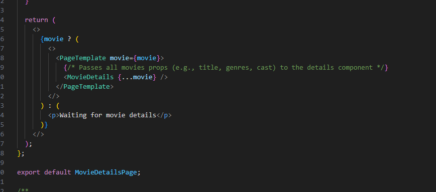

### Source attribution

- https://stackoverflow.com/questions/46160461/how-do-you-set-the-document-title-in-react?

### Movie Details component

The **movieDetails/index.tsx** component accepts a movie object as a prop pulled from the 'MovieDetailsProps' interface in hte **types/interfaces.ts**

```
const MovieDetails: React.FC<MovieDetailsProps> = (movie) => {
...

```

which will, then, be passed in the various components as properties to fetch the movie object data, as seen below

```
 {/* Overview Section */}
      <Box sx={{ paddingTop: "4%" }}>
        <Typography variant="h5" component="h3">
          {t("overview")}
        </Typography>
      </Box>

      <Typography variant="h6" component="p">
        {movie.overview}
      </Typography>
```

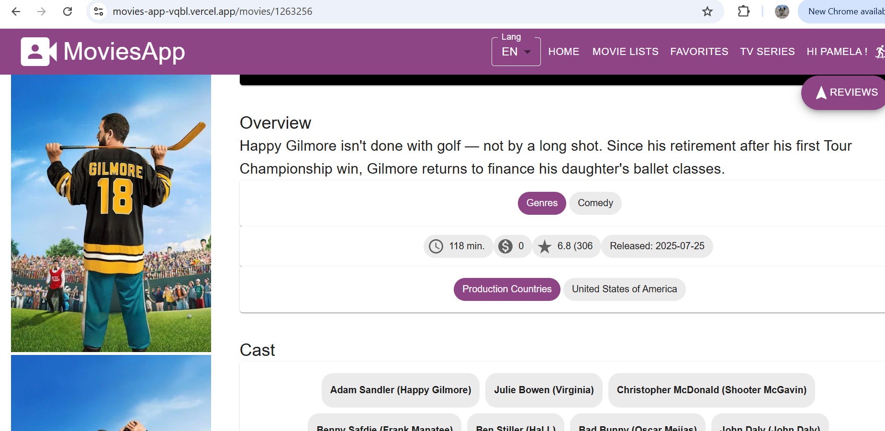

The state variable 'videoKey' is used to store a YouTube trailer key, which gets fetched using getMovieVideos() in the **tmdb-api.tsx** file, exactly as we have seen in the **homePage.tsx** file, when the component mounts or when movie.id changes:

```
 const [videoKey, setVideoKey] = useState<string>();
```

We, then, create a functional component called 'HeroVideoSection', which takes a movie object and a videoKey string as props.

```
const HeroVideoSection = ({
  movie,
  videoKey,
}: {
  movie: BaseMovieProps;
  videoKey?: string;
}) => (

```

At this point, right inside a card component, we use a ternary operator to check if videoKey exists.

```
 <Card
      sx={{
        position: "relative",
        height: "70vh",
      }}
    >
      {videoKey ? (
        // https://stackoverflow.com/questions/63842284/autoplay-video-in-react-material-ui-cardmedia-component
        <CardMedia
          component="iframe"
          src={`https://www.youtube.com/embed/${videoKey}?autoplay=1&mute=1&loop=1&playlist=${videoKey}`}
          title={movie.title}
          sx={{
            width: "100%",
            height: "100%",
            border: "none",
          }}
          allow="autoplay; encrypted-media"
          allowFullScreen
        />
      ) : (
        <CardMedia
          component="img"
          image={`${IMAGE_BASE}${movie.poster_path}`}
          alt={movie.title}
          title={movie.title}
          sx={{ width: "100%", height: "100%", objectFit: "cover" }}
        />
      )}
```

If it does, the CardMedia with component="iframe" to embed the trailer will autoplay, mute, and loop using YouTube parameters. If there's no trailer, it falls back to a static image using the poster path.

We also use a Box component inside the Card, 'absolutely' positioned near the bottom right, with a semi-transparent background and padding for readability.

```
  {/* Movie Title Overlay box */}
      <Box
        sx={{
          position: "absolute",
          bottom: "10%",
          right: "1%",
          color: "white",
          backgroundColor: "rgba(0,0,0,0.5)",
          padding: "1rem",
          borderRadius: "8px",
          minWidth: "20%",
        }}
      >
        <Typography variant="h4">{movie.title}</Typography>
      </Box>
```

At this point, we use useEffect() hook to perform data fetching after the component renders. It depends on movie.id, so it re-runs if the selected movie changes.
Hence, we first define an async function inside it called 'fetchData', and soon afterwards we call the getMovieVideos function from the **tmdb-api.tsx** and pass the movie id in. This returns an array of video objects.

```
useEffect(() => {
    const fetchData = async () => {
      /**
       * useEffect hook that runs a function as a 'side effect' after the component renders.
       * Here, it runs when `movie.id` changes, and is used to fetch the corresponding trailer video.
       */

      /**
       * Fetch the videos associated with the selected movie.
       * https://developer.themoviedb.org/reference/movie-videos
       * - Looks specifically for a "Trailer" hosted on "YouTube".
       * - If found, stores the trailer's `key` in state to be embedded later.
       */
      const videos = await getMovieVideos(movie.id);

      console.log("Videos: ", videos);

      /**
       * We then find() the specific video trailer.
       * Only trailers hosted on YouTube are valid for embedding.
       */
      const trailer = videos.find(
        (v: VideoTrailer) => v.type === "Trailer" && v.site === "YouTube"
      );

      console.log("Trailer: ", trailer);

      // We then grab the trailer 'key', as per the 'VideoTrailer' interface.
      // Could be undefined if no trailer is found, hence '?'
      setVideoKey(trailer?.key);
    };

    // Call the async function
    fetchData();
  }, [movie.id]);

```

We use .find() to locate a video where type is "Trailer" and site is "YouTube", which is required for embedding.

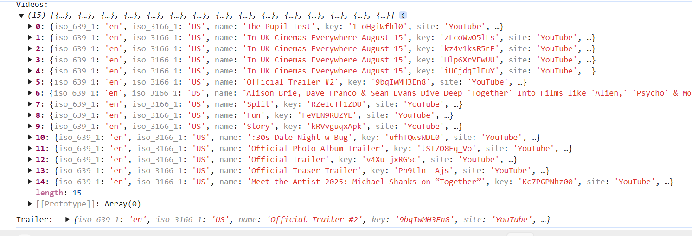

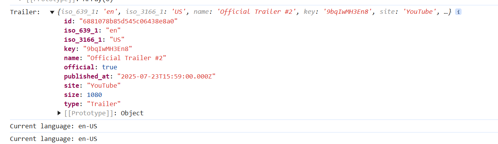

If a matching trailer is found, we extract its key, which is the YouTube video id, and update the state using setVideoKey. If not found, it sets undefined.

Regarding the 'Cast' section, it is worth pointing out the steps followed to display the movie credits and how we made them clickable.
We first safely verify that 'movie.cast' exists and is an array using 'Array.isArray()', and that it contains at least one item using '.length > 0'.

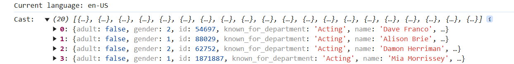

The next step is map through each actor in the cast array to render them individually.

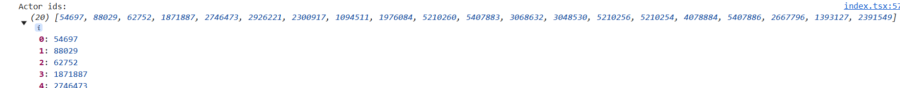

Each actor is wrapped in a '<li>' element and assigned a unique key using actor.id.
We also use React Router’s Link to make each actor clickable, leading to a detailed actor page. The state prop carries both the actor and movie data to the destination page.
We finally display actor info using a Chip component
Each actor is rendered inside a Material UI Chip, which is styled and set to be clickable, and a Box to wrap the actor’s name and character on mobile view.

```
{/*
      To safely handle the movie.cast potentially being undefined or empty, we are using
      Array.isArray to avoid '.length' checks on possibly undefined values.
      It ensures it’s a valid array before accessing .length or using .map()
      Only render cast list if it's a valid non-empty array.
      https://www.geeksforgeeks.org/typescript-array-isarray-method/?utm_source=chatgpt.com
      */}
      {Array.isArray(movie.cast) && movie.cast.length > 0 ? (
        <Paper component="ul" sx={styles.chipSet}>
          {movie.cast.map((actor) => (
            <li key={actor.id}>
              <Link
                to={`/movies/${movie.id}/actor/${actor.id}`} // URL path for the actor page
                state={{ actor: actor, movie: movie }} // Pass actor and movie data as navigation state
                style={{ textDecoration: "none" }} // Optional styling to remove underline from link
              >
                <Chip
                  clickable
                  label={
                    <Box
                      sx={{
                        // Allows text to wrap onto multiple lines instead of staying on a single line
                        // https://developer.mozilla.org/en-US/docs/Web/CSS/white-space
                        whiteSpace: "normal",
                        wordBreak: "break-word",
                        fontWeight: "bold",
                      }}
                    >
                      {`${actor.name} (${actor.character})`}
                    </Box>
                  }
                  sx={{
                    ...styles.chipLabel,
                    py: 1, // vertical padding
                    minHeight: "3rem", // force taller chip
                  }}
                />
              </Link>
            </li>
          ))}
        </Paper>
      ) : (
        <Typography
          variant="body2"
          color="text.secondary"
          sx={{ textAlign: "center", mt: 1 }}
        >
          No cast information available.
        </Typography>
      )}

```

### Source attribution

- https://image.tmdb.org/t/p/w500
- https://mad9022.github.io/W2022/modules/week5/api-fetch/#the-movie-db-review
- https://stackoverflow.com/questions/63842284/autoplay-video-in-react-material-ui-cardmedia-component
- https://developer.themoviedb.org/reference/movie-videos
- https://www.geeksforgeeks.org/typescript-array-isarray-method/?utm_source=chatgpt.com
- https://developer.mozilla.org/en-US/docs/Web/CSS/white-space
- https://mui.com/system/getting-started/the-sx-prop/?

### Movie Header component

The **headerMovie/index.tsx** component displays the top section of a movie detail page, showing the movie title, tagline, and optional icons based on user preferences: 'favourites' and/or 'must-watch'.

It uses Material UI components like Paper, Avatar, and IconButton for layout and styling.

Soon after the component is defined and access the 'MovieDetailsProps' in the **types/interfaces.tsx**, we access the 'movieContext' to fetch the 'favourites' and 'must - watch' lists functions by descructuring and exctracing them:

```
 const context = useContext(MoviesContext);

  // Destructure favourites and mustWatchList arrays from the context
  const { favourites, mustWatchList } = context;

```

At that point, we check if any movie in the mustWatchList array, and in the 'favourites' one has the same id as the current one:

```
  // Check if the current movie is in the mustWatchList
  // `.some()` checks if any movie in the list has the same id as the current one
  // https://developer.mozilla.org/en-US/docs/Web/JavaScript/Reference/Global_Objects/Array/some
  const isMustWatch = mustWatchList.some((m) => m.id === movie.id);

  // Check if the current movie is in the favourites list (by id)
  // https://developer.mozilla.org/en-US/docs/Web/JavaScript/Reference/Global_Objects/Array/includes
  const isFavourite = favourites.includes(Number(movie.id));

```

We, then, finally render the movie data in the header.

These are snippets of the 'favourites' and 'must watch':

```
  {/* Show a red avatar with a heart icon if the movie is a favourite */}
      {isFavourite && (
        <Avatar sx={styles.avatar}>
          <FavoriteIcon />
        </Avatar>
      )}

      {/* Show a green avatar with a checklist icon if the movie is in must-watch list */}
      {isMustWatch && (
        <Avatar sx={{ backgroundColor: "rgb(0, 128, 0)" }}>
          <PlaylistAddCheckIcon />
        </Avatar>
      )}
```

### Source attribution

- https://materialui.co/icon/playlist-add-check
- https://developer.mozilla.org/en-US/docs/Web/JavaScript/Reference/Global_Objects/Array/some
- https://developer.mozilla.org/en-US/docs/Web/JavaScript/Reference/Global_Objects/Array/includes

## Actor Bio Page

The **actorBioPage.tsx** displays the actor biographical information, and a photo gallery of them.

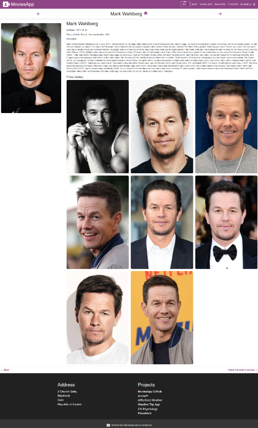

It uses 'useParams' from react-router-dom to extract the 'actorId' and 'movieId' directly from the URL

```
const { movieId, actorId } = useParams() as {
    movieId: string;
    actorId: string;
  };
```

since the page route is from **index.tsx** is the following

```
  <Route path="/movies/:movieId/actor/:actorId"
  element={<ActorBioPage />}
   />
```

Data fetching is handled through react-query via the useQuery hook, which allows asynchronous API calls to retrieve both the actor’s details and images:

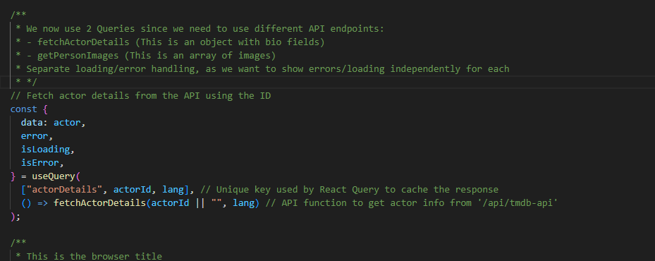

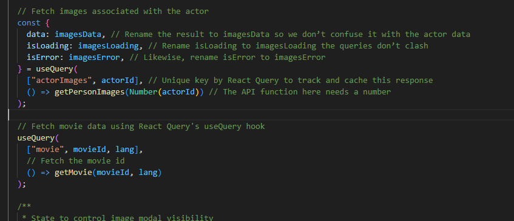

As it can be seen above, the API calls in the **tmdb-api.tsx** file are the following ones:

```
/**
 * Fetches detailed information for an actor/person by ID from TMDb.
 * https://developer.themoviedb.org/reference/person-details
 * 'id' is the actor's person ID as a string.
 */
export const fetchActorDetails = async (id: string, language = "en-US") => {
  const res = await fetch(
    `https://api.themoviedb.org/3/person/${id}?api_key=${
      import.meta.env.VITE_TMDB_KEY
    }&language=${language}`
  );
  if (!res.ok) throw new Error("Failed to fetch actor details");
  return res.json();
};


/**
 * Fetches profile images for a person (actor) from TMDb.
 *  https://developer.themoviedb.org/reference/person-images
 * 'personId' is TMDb ID of the person.
 */
export const getPersonImages = async (personId: number) => {
  const response = await fetch(
    `https://api.themoviedb.org/3/person/${personId}/images?api_key=${
      import.meta.env.VITE_TMDB_KEY
    }`
  );
  if (!response.ok) throw new Error("failed to fetch person images");
  return response.json();
};

```

The actor’s bio and photos are displayed using Material UI components within a shared layout provided by **templateMoviePage/index.tsx**.

However, because 'TemplateMoviePage' expects a movie object (but we area showing data of an actor), a 'dummy placeholder interface' is constructed using the actor’s data.

```
/**
   * A dummy movie object to pass to the template is needed in our ActorBioPage component because the page is built
   * using the shared layout/template component <TemplateMoviePage />, which expects a valid movie object as a prop. This is to abyde by
   * the DRY principle and not to create duplicated template when possible.
   * Here, though, we are not using movie data, but the template still requires a movie prop of type MovieDetailsProps.
   * After all, we still need to provide data that matches the structure of the templateMoviePage, although it is the actorBioPage we are showing here.
   * Hence, a placeholder is created to satisfy the type and structural requirements of the TemplateMoviePage without feeding the page with any movie data.
   * We will then be adding some <Typography /> to add actor bio data we need and <imageList /> and <ImageListIte /> to create the actor umages grid
   */
  const dummyMovie: MovieDetailsProps = {
    id: 0,
    title: actor?.name || "Actor Bio",
    budget: 0,
    homepage: undefined,
    imdb_id: "",
    original_language: "",
    overview: "",
    release_date: "",
    vote_average: 0,
    popularity: 0,
    // poster_path: firstImage ? firstImage.file_path : undefined, // Actor image as poster
    poster_path: firstImage
      ? `https://image.tmdb.org/t/p/w500${firstImage.file_path}`
      : undefined,
    tagline: "",
    runtime: 0,
    revenue: 0,
    vote_count: 0,
    genres: [],
    production_countries: [],
    cast: [],
    release: [],
  };
```

The component also uses useState() hook to manage state for an image modal in the gallery.

```
 /**
   * State to control image modal visibility
   * modalOpen → controls if the image modal is shown
   */
  const [modalOpen, setModalOpen] = useState(false); // Every render would reset it back to false

  /**
   * currentIndex tracks the currently selected image index in the gallery
   * If you didn’t use useState, React wouldn’t remember which image to show or whether the
   * modal is open between renders.
   * */
  const [currentIndex, setCurrentIndex] = useState(0);

```

The modalOpen state is a boolean that determines whether the image modal (a pop-up view of a larger image) is visible on the screen, and it starts as false, meaning the modal is initially hidden.
When a user clicks on an image, setModalOpen(true) is called to show the modal.
The currentIndex state, instead, tracks which image in the gallery is currently being displayed in the modal, hence, it starts at 0, which means that the first image will be shown initially.
As the user navigates through the images using arrow buttons, setCurrentIndex() updates this index to display the correct image. In the end, this stateful logic ensures that users can open a modal, view and switch images smoothly, and then close the modal.

However, since we want to use the first image amonst those fetched by the API call in getPersonImages() as a 'featured image', we create a new array called 'galleryImages' by slicing the original 'actorImages' array starting from the second element (index 1).

```

  // Extract actor profile images (array of image objects)
  // https://search.r-project.org/CRAN/refmans/TMDb/html/person_images.html?
  const actorImages = imagesData?.profiles || [];

  // First image is used for the left image section of the template
  const firstImage = actorImages.length > 0 ? actorImages[0] : undefined;

  /**
   * All other images will be shown in the photo gallery
   * The .slice() method returns a shallow copy of a portion of an array into a new array object.
   * https://www-igm.univ-mlv.fr/~forax/MDN/developer.mozilla.org/en-US/docs/Web/JavaScript/Reference/Global_Objects/Array/slice.html
   * */
  const galleryImages = actorImages.slice(1);

```

Hence, in the 'TemplateMoviePage' component, we pass two props: movie and overrideImages.

```
<TemplateMoviePage
  movie={dummyMovie}
  overrideImages={firstImage ? [firstImage] : []}
>
```

TemplateMoviePageProps
`movie={dummyMovie}` provides a mock or placeholder movie object to satisfy the component’s expected structure. Since the page is about an actor, not a movie, the real movie data is not relevant, but because 'TemplateMoviePage' is designed to always expect a movie prop we pass 'dummyMovie' to prevent errors and maintain layout consistency.

`overrideImages={firstImage ? [firstImage] : []}` conditionally passes an array containing the actor's first image. If firstImage exists, this tells the template to use that image instead of a typical movie poster.

The below code, instead, manages the image modal gallery In particular:

- the 'openModal' function sets the currently selected image index and makes the modal visible.
- the 'prevImage' and 'nextImage' functions let users navigate through images, wrapping around when reaching the start or end of the gallery to create a seamless carousel effect. - the 'closeModal' hides the modal by updating its visibility state.
  Together, these functions control which image is shown and handle opening, navigating, and closing the modal gallery.

```
 // Opens the image modal and displays the selected image
  // https://reactjsexample.com/a-lightweight-react-hook-for-modals-dialogs/
  // https://react.dev/learn/state-a-components-memory
  // https://thewebdev.info/2021/01/26/create-an-image-modal-with-react-and-javascript/
  // https://learnersbucket.com/examples/interview/create-a-lightbox-modal-image-gallery-in-reactjs/
  const openModal = (index: number) => {
    setCurrentIndex(index); // Store the index of the clicked image so we can track which image is shown
    setModalOpen(true); // Set the modal's visibility to true so it appears on screen
  };

  // Moves to the previous image in the gallery
  // If currently at the first image, wrap around to the last
  // https://www.freecodecamp.org/news/build-an-image-carousel-with-react-and-framer-motion
  const prevImage = () => {
    setCurrentIndex((prev) =>
      prev === 0 ? galleryImages.length - 1 : prev - 1
    );
  };

  // Moves to the next image in the gallery
  // If currently at the last image, wrap around to the first
  // https://www.freecodecamp.org/news/build-an-image-carousel-with-react-and-framer-motion
  const nextImage = () => {
    setCurrentIndex((prev) =>
      prev === galleryImages.length - 1 ? 0 : prev + 1
    );
  };

  // Closes the image modal
  const closeModal = () => {
    setModalOpen(false); // Hides the modal by updating its visibility state
  };

```

if the actor does have images in the TMDB database, they will be showing in a Box inside the ImageListItem inside a Box whose display CSS property is set to 'grid', so that the images will be arranged in a responsive grid with 1-3 columns depending on screen size.
Each image is clickable to open the modal, styled with rounded corners and proper sizing.

```
{galleryImages.length > 0 && (
            <>
              <Typography variant="h6" gutterBottom>
                {t("photogallery")}
              </Typography>
              {/* Responsive image grid */}

              <Box
                sx={{
                  // Use CSS Grid layout to arrange the imageList children component
                  display: "grid",
                  gap: 2,
                  /**
                   * Define the number and size of columns responsively.
                   * '1fr' means one fraction of the available space, which is translated into
                   * 1 column, and so on.
                   * https://mui.com/system/getting-started/the-sx-prop/
                   * https://mui.com/system/react-box/
                   * https://mui.com/system/grid/
                   */
                  gridTemplateColumns: {
                    xs: "1fr", // 1 column on mobile
                    sm: "1fr 1fr", // 2 columns on tablets
                    md: "1fr 1fr 1fr", // 3 columns on desktop
                  },
                }}
              >
                {galleryImages.map(
                  (
                    img: { file_path: React.Key | null | undefined },
                    index: number
                  ) => (
                    <ImageListItem key={img.file_path}>
                      <Box
                        component="img"
                        src={`https://image.tmdb.org/t/p/w300${img.file_path}`}
                        alt={actor?.name}
                        loading="lazy"
                        onClick={() => openModal(index)}
                        sx={{
                          borderRadius: 2,
                          cursor: "pointer",
                          width: "100%",
                          height: "auto", // Maintain aspect ratio
                        }}
                      />
                    </ImageListItem>
                  )
                )}
              </Box>
            </>
          )}
```

Clicking on a photo opens a modal (overlay) with a dark background, and displays the image in full-screen, with arrow buttons to navigate between images and a close button.

```
{/**
           * Zoom modal for viewing images larger with arrow controls
           * https://reactjsexample.com/a-lightweight-react-hook-for-modals-dialogs/
           * https://react.dev/learn/state-a-components-memory
           * https://thewebdev.info/2021/01/26/create-an-image-modal-with-react-and-javascript/
           * https://learnersbucket.com/examples/interview/create-a-lightbox-modal-image-gallery-in-reactjs/
           *
           *  */}
          {modalOpen && (
            <div
              style={{
                position: "fixed",
                top: 0,
                left: 0,
                width: "100vw",
                height: "100vh",
                backgroundColor: "rgba(0,0,0,0.85)",
                display: "flex",
                justifyContent: "center",
                alignItems: "center",
                zIndex: 1500,
              }}
            >
              {/* Close modal button */}
              <IconButton
                onClick={closeModal}
                style={{
                  position: "absolute",
                  top: 20,
                  right: 20,
                  color: "white",
                }}
                aria-label="close"
              >
                <CloseIcon fontSize="large" />
              </IconButton>

              {/* Previous image button */}
              <IconButton
                onClick={prevImage}
                style={{
                  position: "absolute",
                  top: "50%",
                  left: 20,
                  color: "white",
                }}
                aria-label="previous"
              >
                <ArrowBackIosNewIcon fontSize="large" />
              </IconButton>

              {/* Fullscreen image display */}
              

              {/* Next image button */}
              <IconButton
                onClick={nextImage}
                style={{
                  position: "absolute",
                  top: "50%",
                  right: 20,
                  color: "white",
                }}
                aria-label="next"
              >
                <ArrowForwardIosIcon fontSize="large" />
              </IconButton>
            </div>
          )}
        </>
```

The modal state is managed using useState to track which image is currently shown and whether the modal is open.

At the top-right, an IconButton with a close icon triggers closeModal to hide the modal, whereas on the left and right sides, arrow buttons allow navigating backward and forward through the image list using 'prevImage' and 'nextImage'.
In the center of the screen, an  tag displays the current image selected from 'galleryImages[currentIndex]'.
The modal ensures the image fills the screen responsively using maxHeight and maxWidth and that it stays on top of other content with a high 'zIndex' and centers content using flex.
Clicking the image itself does nothing, but the navigation and close icons provide full control.

Last but not least, a sticky bottom navigation bar was added and stays visible at the bottom of the screen. It uses a responsive flex layout to space two links apart: one to go back and another to view the actor’s movie list.

### Source attribution

- https://react.i18next.com/latest/usetranslation-hook
- https://reactrouter.com/en/main/hooks/use-location
- https://reactrouter.com/en/main/hooks/use-navigate#passing-state
- https://stackoverflow.com/questions/46160461/how-do-you-set-the-document-title-in-react
- https://search.r-project.org/CRAN/refmans/TMDb/html/person_images.html
- https://www-igm.univ-mlv.fr/~forax/MDN/developer.mozilla.org/en-US/docs/Web/JavaScript/Reference/Global_Objects/Array/slice.html
- https://reactjsexample.com/a-lightweight-react-hook-for-modals-dialogs/
- https://react.dev/learn/state-a-components-memory
- https://thewebdev.info/2021/01/26/create-an-image-modal-with-react-and-javascript/
- https://learnersbucket.com/examples/interview/create-a-lightbox-modal-image-gallery-in-reactjs/
- https://www.freecodecamp.org/news/build-an-image-carousel-with-react-and-framer-motion

## TV Series Actor Bio page

The **TVSeriesActorBioPage.tsx** is a clone of the previous page which has been repurposed for the TV series data by fetching them through the API function getTVSeries() in the **tmdb-api.tsx** file.

```
/**
 * This is cloned from getMovie function, modified to fetch TV series details instead of movies.
 * https://developers.themoviedb.org/3/tv/get-tv-details
 *
 *  */
export const getTVSeries = (id: string | number, language = "en-US") => {
  console.log("Requested language:", language);
  return fetch(
    `https://api.themoviedb.org/3/tv/${id}?api_key=${
      import.meta.env.VITE_TMDB_KEY
    }&language=${language}`
  ).then((response) => {
    if (!response.ok) {
      throw new Error(
        `Failed to get TV series data. Response status: ${response.status}`
      );
    }
    return response.json();
  });
};

```

This used in the below useQuery, which might appear redundant, as we do not really show TV series data on the TV series actor page.

```
  // Fetch TV series data using React Query's useQuery hook
  useQuery(
    ["tv", tvId, lang],
    // Fetch the TV series id
    () => getTVSeries(tvId, lang)
  );

```

Howevr, if the user does click the back link on the sticky bar at the bottom of the page to go back to the TV series page (/tvseries/:tvId), the useQuery already has the data in its cache. That means it can render instantly without making another API request.

This holds true in the Actor bio page too where we have the same type of useQuery for movies.

## Actor Movies page

The **actorMoviesPage.tsx** displays all movies associated with a specific actor, by retrieving them via the API function getActorMovies() in the **tmdb-api.tsx** file.

```

/**
 * Fetches the movies an actor played.
 * https://tmdbapis.metamanager.wiki/en/latest/_modules/tmdbapis/api3.html
 * 'id' is the ID of the actor (can be a string or number)
 */
export const getActorMovies = (id: string | number, language = "en-US") => {
  return fetch(
    `https://api.themoviedb.org/3/person/${id}/movie_credits?api_key=${
      import.meta.env.VITE_TMDB_KEY
    }&language=${language}`
  )
    .then((res) => res.json())
    .then((json) => {
      console.log(json.cast);
      return json.cast;
    });
};

```


It fetches the actor's and movie ids from the URL using useParams.

```
// Extract the 'id' parameter from the URL using React Router's useParams hook
  const { movieId, actorId } = useParams() as {
    movieId: string;
    actorId: string;
  };
```

As a matter of fact, the route in the **index.tsx** for this page is the following:

```
<Route
  path="/movies/:movieId/actor/:actorId/movies"
  element={<ActorMoviesPage />}
/>

```

We need the movie id mainly for navigation purposes, pretty much like in the **actorBioPage.tsx**, as we avail of a sticky bar at the very bottom of the page for navigation purposes.

```
<Link
          to={`/movies/${movieId}/actor/${actorId}`}
          style={{
            textDecoration: "none",
            color: "#8E4585",
            fontWeight: "bold",
            textAlign: "right",
          }}
        >
          ← {t("back_to_actor_page")} {actorDetails?.name}
        </Link>
      </Box>
```

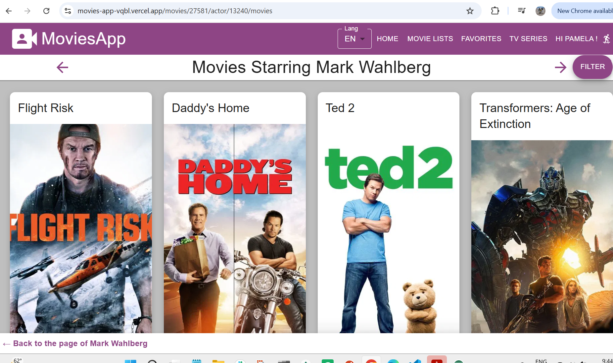

The code here uses React Query's useQuery hook to fetch and cache two sets of data: the actor’s movies and their personal details.

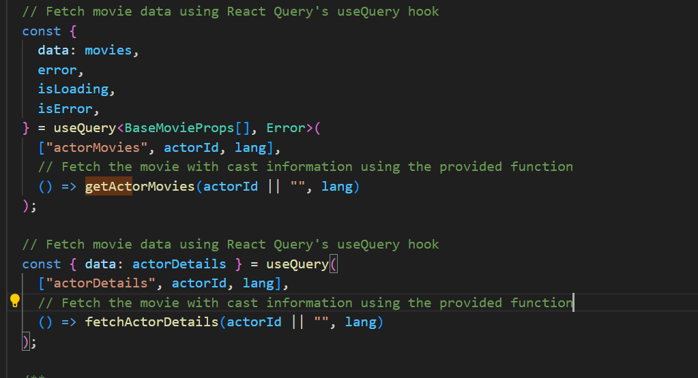

The first query fetches an array of movies the actor has appeared in. The useQuery hook takes a unique query key (["actorMovies", actorId, lang]) to track the result, and the function getActorMovies() that actually performs the API call using the 'actorId' and selected 'lang'.

The second query fetches details about the actor, but it will only be used to extract the actor name used on the header, brower title, and on the sticky navigation bar at the bottom of the page.

Finally, the template used on this page is the 'templateMovieListPage'.

## Actor TV Series page

The **actorTVSeriesPage.tsx** shares a similar structure with the **actorMoviesPage.tsx** file, and logic, as it was created as a clone of the latter.
Hoever, a few little differences worthy to point out are the below ones:

- 'ActorMoviesPage' fetches and displays movies using getActorMovies, while 'ActorTVSeriesPage' handles TV series using the getActorTVSeries function in the **tmdb-api.tsx** file.

```
/**
 * Fetches the TV series an actor appeared in.
 * 'id' refers to the actor's id.
 * https://developer.themoviedb.org/reference/person-tv-credits
 */
export const getActorTVSeries = (id: string | number, language = "en-US") => {
  return fetch(
    `https://api.themoviedb.org/3/person/${id}/tv_credits?api_key=${
      import.meta.env.VITE_TMDB_KEY
    }&language=${language}`
  )
    .then((res) => res.json())
    .then((json) => {
      console.log(json.cast);
      return json.cast; // This returns an array of TV series the actor was in
    });
};

```

- Each uses a different template, as we created the **templateTVSeriesPage.tsx** ad hoc to use for TVSeries data.
- Filtering components are similar, but they differ on the data they fetch, but this will be discussed in a dedicated chapter.
  . Additionally, only the movie page includes a feature to add items to favourites.

## Movie Filter UI

The **movieFilterUI/index.tsx** is a UI component that provides a floating 'Filter button s that users can open a side drawer upon clicking on it, where they can apply filters to a list of movies. It supports filtering by title, genre, release year, and sorting order.

The actual filtering form is rendered inside a reusable FilterCard component.

The main features added are:

- useTranslation
  The useTranslation hook from react-i18next is used to support translations on the website. This allows the UI to display translated labels like 'Filter'.
- releaseFilter:
  We added this new function 'releaseFilter' to filter movies by release year. It basically converts the selected year (as a string) to a number, and compares it to the year extracted from each movie's release_date.

```
/**
 * This function filters movies by their release year.
 * It returns true if the movie's release year matches the given year (value).
 * If value is 0, it means "All years" and the function returns true for every movie.
 * value: number is a parameter passed into the releaseFilter function, and
 * it represents the year selected by the user to filter movies by release date
 * However, this function was throwing an error when deploying in Vercel:
 * Types of property 'value' are incompatible.
 * Type 'number' is not assignable to type 'string'. src/pages/discoverPage.tsx(89,5): error TS2322:
 * Type '{ name: string; value: number; condition: (movie: BaseMovieProps, value: number) => boolean; }'
 * is not assignable to type 'Filter'.
 * Hence, I changed the value to 'string', but then converted to number for comparison.
 * useFiltering.ts
 * interface Filter {
 * name: string;
 * value: string;
 * condition: (item: any, value: string) => boolean;
 * }
 * */
// eslint-disable-next-line react-refresh/only-export-components
export const releaseFilter = (
  movie: BaseMovieProps,
  value: string
  // The : boolean after the parameters means this function will always return a boolean value (true or false)
  // https://www.typescriptlang.org/docs/handbook/2/functions.html#function-types
): boolean => {
  // Convert the value to a number for comparison
  const year = Number(value);
  // If value is 0, do not filter out any movies, but show them all
  if (year === 0) return true;
  // If the movie has no release date, exclude it and return it as false
  else if (!movie.release_date) return false;
  /**
   * Extract the year from the movie's release_date string
   * getFullYear() is a built-in JavaScript Date object method.
   * https://developer.mozilla.org/en-US/docs/Web/JavaScript/Reference/Global_Objects/Date/getFullYear
   */
  const movieYear = new Date(movie.release_date).getFullYear();
  // Return true only if the movie's release year equals the filtered year
  return movieYear === year;
};
```

- New props in MovieFilterUIProps:
  'releaseFilter',and 'sortOrder' were added to the component props interface, enabling the filter UI to manage release year and sorting options.

```
interface MovieFilterUIProps {
  onFilterValuesChange: (f: string, s: string) => void;
  titleFilter: string;
  genreFilter: string;
  releaseFilter: number;
  // Controls the sorting order of movies by release date.
  sortOrder: string;
}

```

- Passing the new props to the FilterCard:
  The FilterCard component now receives releaseFilter and sortOrder as additional props, likely to allow filtering by release year and sorting directly from the drawer UI.

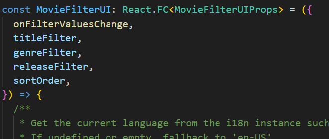

These changes enhance the component’s functionality with multilingual support, more filtering, and UI responsiveness/styling.

### Source attribution

- https://react.i18next.com/latest/usetranslation-hook
- https://www.typescriptlang.org/docs/handbook/2/functions.html#function-types
- https://developer.mozilla.org/en-US/docs/Web/JavaScript/Reference/Global_Objects/Date/getFullYear
- https://mui.com/system/getting-started/the-sx-prop

## Filter Movie card

This **filterMoviesCard/index.tsx** component now supports translated content via useTranslation() 'react-i18next' hook, dynamic genre fetching by language, as the getGenres() api function in the **tmdb-api.tsx** file has been extended to pass in the parameter 'lang',

```
export const getGenres = (language = "en-US") => {
  return fetch(
    "https://api.themoviedb.org/3/genre/movie/list?api_key=" +
      import.meta.env.VITE_TMDB_KEY +
      `&language=${language}`
  )
    .then((response) => {
      if (!response.ok)
        throw new Error(
          `Unable to fetch genres. Response status: ${response.status}`
        );
      return response.json();
    })
    .catch((error) => {
      throw error;
    });
};
```

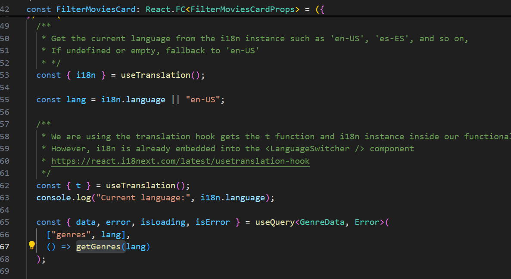

and adds 'release year' filtering, and sorting functionality in its 'FilterMoviesCardProps'.

```
export interface FilterMoviesCardProps {
  onUserInput: (f: FilterOption, s: string) => void; // Add this line
  titleFilter: string;
  genreFilter: string;
  releaseFilter: number;
  sortOrder: string;
}
```

We, then, get the current year using new Date().getFullYear().

```
/**
   * Get the current year using the Date object
   * `new Date()` creates a Date instance representing the current date and time.
   * getFullYear()` extracts the full year as a 4-digit number .
   * https://developer.mozilla.org/en-US/docs/Web/JavaScript/Reference/Global_Objects/Date/getFullYear
   */
  const currentYear = new Date().getFullYear();
```

The next is to generate an array of years from the current year down to 1950 using Array.from().
For example, if the current year is 2025, the array will be: 2025, 2024, 2023, ..., 1950].
This is used to populate a dropdown menu for filtering movies by release year.

```
  /**
   * Create an array of years from currentYear down to 1950 (random year).
   * The Array.from() static method creates a new, shallow-copied Array instance
   * from an iterable or array-like object.
   * The array will contain (currentYear - 1949) elements to include 1950.
   * Example: if currentYear = 2025, then length = 2025 - 1949 = 76.
   * The map function takes two arguments:
   * `_` is the current value
   * `i` is the current index in the array.
   * For each index `i`, we subtract `i` from `currentYear` to get descending years.
   * Example: i = 0 → 2025, i = 1 → 2024, ..., i = 75 → 1950
   * https://developer.mozilla.org/en-US/docs/Web/JavaScript/Reference/Global_Objects/Array/from
   * https://developer.mozilla.org/en-US/docs/Web/JavaScript/Reference/Global_Objects/Array/from#using_arrow_functions_and_array.from
   * https://developer.mozilla.org/en-US/docs/Web/JavaScript/Reference/Global_Objects/Array/from#sequence_generator_range
   */
  const years: number[] = Array.from(
    { length: currentYear - 1949 },
    (_, i) => currentYear - i
  );
```

We, then, craete a 'handle' for the releaseFilter

```
const handleReleaseYearChange = (e: SelectChangeEvent) => {
    handleChange(e, "release", e.target.value);
  };
```

When the user selects a different year, the 'SelectChangeEvent' is triggered, and passes the selected value to the 'handleChange' function, specifying that the filter type is 'release'.
This allows the parent component to update its filter state accordingly.

At this point, we need to ensure that the value insterted in the <Select> tag is a string (toString()), since that is what that components expects.

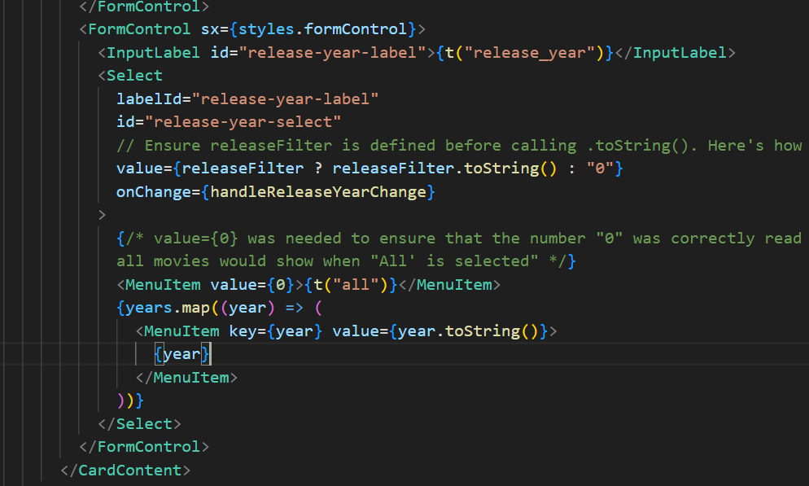

If 'releaseFilter' is 0 or undefined, it defaults to "0" which represents the "All" option (no filtering by year).
We then pass in the 'handleReleaseYearChange' function which updates the filter state in the parent component using the 'release' filter type.
Since the first item in the dropdown is 'All (translated), we pass the value '0' in as a number.

```
<MenuItem value={0}>
```

Selecting this sets the filter to "0", meaning 'show all movies'.
Finally, we 'map' the years to dynamically render the dropdown options for each year from the current year down to 1950.

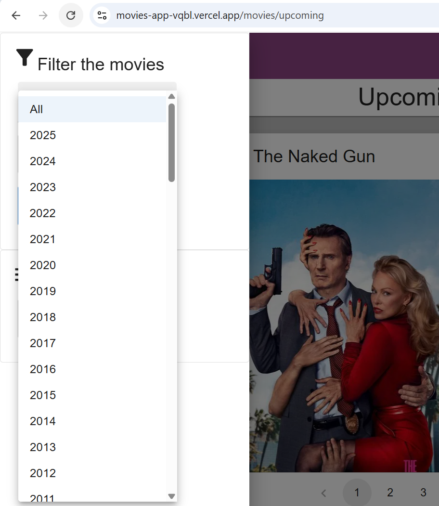

The 'sortOrder', instead, allows the user to choose how movies are sorted by 'release date' either oldest first (asc) or newest first (desc). Here's how it works step by step:

It is passed as a prop from the parent component 'MovieFilterUI into FilterMoviesCard, as seen above, and it holds a string value: "asc" for ascending or "desc" for descending.
Inside the second <Card>, there's a <Select> dropdown for sorting:

```
<FormControl sx={styles.formControl}>
  <InputLabel id="sort-label">{t("sort_by_date")}</InputLabel>
  <Select
    labelId="sort-label"
    id="sort-select"
    value={sortOrder}
    onChange={handleSortOrder}
  >
    <MenuItem value="asc">{t("oldest_first")}</MenuItem>
    <MenuItem value="desc">{t("newest_first")}</MenuItem>
  </Select>
</FormControl>

```

When a user selects an option (asc or desc), it triggers:

```
const handleSortOrder = (e: SelectChangeEvent) => {
  handleChange(e, "sort", e.target.value);
};

```

This then calls the onUserInput() prop function passed from the parent, updating the filter state.
Hence, the updated sortOrder value is used (in the parent component) to sort the movie list accordingly before rendering.

### Source attribution

- https://react.i18next.com/latest/usetranslation-hook
- https://developer.mozilla.org/en-US/docs/Web/JavaScript/Reference/Global_Objects/Date/getFullYear
- https://developer.mozilla.org/en-US/docs/Web/JavaScript/Reference/Global_Objects/Array/from
- https://developer.mozilla.org/en-US/docs/Web/JavaScript/Reference/Global_Objects/Array/from#using_arrow_functions_and_array.from
- https://developer.mozilla.org/en-US/docs/Web/JavaScript/Reference/Global_Objects/Array/from#sequence_generator_range

## Filtering and sorting features on each page

These three constants below define the initial filter settings for the movie list.
Each filter has a name to identify it, a default value that starts empty or at "0" (meaning no filter applied yet), and a condition (imported from 'MovieFilterUI') which is a function that knows how to check if a movie matches that filter.
Specifically, 'titleFiltering' filters movies by their title, 'genreFiltering' by genre, and 'releaseFiltering' by release year, as seen in both 'movieFilterUI' and 'filterMoviesCard'.

```
const titleFiltering = {
  name: "title",
  value: "",
  condition: titleFilter,
};
const genreFiltering = {
  name: "genre",
  value: "0",
  condition: genreFilter,
};

// Define the default filter state for release filtering
const releaseFiltering = {
  name: "release",
  value: "0",
  condition: releaseFilter,
};
```

We, then, create a useState hook called 'sortOrder' with an initial value of "desc", which means the movies will be sorted from newest to oldest by default.
Then, we call the custom hook 'useFiltering' to manage the filters returning three things:

- the current filter values (filterValues),
- a function to update those values (setFilterValues),
- and a filterFunction that applies all the filters to a list of movies.

The filters it manages are the 'title', 'genre', and 'release' filters defined earlier.

```
 // Create the state for 'sortOrder' and set to newest first
  const [sortOrder, setSortOrder] = useState("desc");

  const { filterValues, setFilterValues, filterFunction } = useFiltering([
    titleFiltering,
    genreFiltering,
    releaseFiltering,
  ]);

```

When the user changes a filter or sorting option, the function 'changeFilterValues' is called with the type of change (type) and the new value (value).
If the change is for sorting (type === "sort"), then, it updates the sortOrder state directly and immediately returns, skipping the rest of the function.
This keeps sorting separate from the filters.

```
// Called when the user changes title, genre filter, release year, and sort
  const changeFilterValues = (type: string, value: string) => {
    if (type === "sort") {
      /**
       * Sort is managed by its own state sortOrder, not in the filterValues array.
       * So we update the sort order separately and exit early to skip the rest of the filter logic.
       * */
      setSortOrder(value);
      /**
       * So, by returning early, we make sure only setSortOrder is called,
       * and we avoid mistakenly trying to update filter state with an invalid type.
       */
      return;
    }

    const changedFilter = { name: type, value };
    const updatedFilterSet =
      /**
       * If type === "title", update the first filter.
       * Otherwise, if type === "genre", update the second filter.
       * Otherwise, type === "release", update the third filter.
       */
      type === "title"
        ? [changedFilter, filterValues[1], filterValues[2]]
        : type === "genre"
        ? [filterValues[0], changedFilter, filterValues[2]]
        : [filterValues[0], filterValues[1], changedFilter];
    setFilterValues(updatedFilterSet);
  };

```

If the change is for one of the filters (title, genre, or release), it creates a new filter object with the updated value, then builds a new array of filters by replacing only the one that changed, keeping the others as they were.
Finally, it updates the filter state with this new set of filters using 'setFilterValues'. This, in the end, ensures that only the relevant filter is updated each time.

The 'filterFunction()' will be applied to the 'movies'

```
  // This is the ternary operator, which works like an inline if...else.
  const movies = data ? data.results : [];
  const displayedMovies = filterFunction(movies);

```

and passed in the 'templateMoviePage', so that thew new filtered movie array will be displayed on the page.

```
<PageTemplate
        // title="Discover Movies"
        title={t("discover_movies")}
        movies={sortedDisplayedMovies}
        // movies={paginatedMovies}
        action={(movie: BaseMovieProps) => {
          return <AddToFavouritesIcon {...movie} />;
        }}
      />
```

Howver, as it can be seen above, we first 'sort' the 'displayedMovies' array using the spread operator ([...]) to avoid changing the original array (we noticed that we were getting duplicated movies for some reason we were unable to explain before this step).
Then, it sorts the copied list based on each movie’s release_date. If either movie lacks a release date, it skips comparing them.
Otherwise, it uses localeCompare to sort the dates.
If the sortOrder is "asc", it arranges movies from oldest to newest. If it’s "desc", it does the reverse—from newest to oldest.

The final result, sortedDisplayedMovies, is the list of filtered and properly sorted movies ready to be displayed.

Finally, we pass the current filter values (title, genre, release year) and the current sort order to the MovieFilterUI component.
We also pass the function 'changeFilterValues' to call when the user changes any of the filters or sort option.

This keeps everything in sync with the user's selections.

```
<MovieFilterUI
        onFilterValuesChange={changeFilterValues}
        titleFilter={filterValues[0].value}
        genreFilter={filterValues[1].value}
        // This is NOT a string, so we wrap it with a Number()
        releaseFilter={Number(filterValues[2].value)}
        sortOrder={sortOrder}
      />
```

1. Filtering Setup
   You have 3 filters defined:

js
Copy
Edit
const titleFiltering = { name: "title", value: "", condition: titleFilter };
const genreFiltering = { name: "genre", value: "0", condition: genreFilter };
const releaseFiltering = { name: "release", value: "0", condition: releaseFilter };
These represent the filter criteria by title, genre, and release year.

You use a custom hook useFiltering to manage filter state and logic:

js
Copy
Edit
const { filterValues, setFilterValues, filterFunction } = useFiltering([
titleFiltering,
genreFiltering,
releaseFiltering,
]);
filterValues holds current filter values.

setFilterValues updates them.

filterFunction applies all filters to a list of movies.

2. Handling Filter Changes
   The function changeFilterValues is called when any filter or sorting option changes:

js
Copy
Edit
const changeFilterValues = (type: string, value: string) => {
if (type === "sort") {
setSortOrder(value);
return;
}

const changedFilter = { name: type, value };
const updatedFilterSet =
type === "title"
? [changedFilter, filterValues[1], filterValues[2]]
: type === "genre"
? [filterValues[0], changedFilter, filterValues[2]]
: [filterValues[0], filterValues[1], changedFilter];

setFilterValues(updatedFilterSet);
};
If the user changes the sort order, update sortOrder state only and exit early.

Otherwise, update the relevant filter in the filterValues array.

3. Filtering the Movies
   Once you have the fetched movies (data.results), you apply filtering:

js
Copy
Edit
const movies = data ? data.results : [];
const displayedMovies = filterFunction(movies);
filterFunction is the logic from the custom hook that applies all filter conditions on the movies list and returns the filtered results.

4. Sorting the Filtered Movies
   After filtering, you sort the filtered movies based on the sortOrder state ("asc" or "desc"):

js
Copy
Edit
const sortedDisplayedMovies = [...displayedMovies].sort((a, b) => {
if (!a.release_date || !b.release_date) return 0;

return sortOrder === "asc"
? a.release_date.localeCompare(b.release_date)
: b.release_date.localeCompare(a.release_date);
});
Important details:

Use the spread operator [...displayedMovies] to make a shallow copy before sorting. This prevents mutating the original array.

Sorting is based on movie release_date strings.

If sortOrder is "asc", sort oldest movies first.

If "desc", newest movies first.

=========== TO BE CONTINUED ==================

## Bugs and defects

The Json stores kept showing errors for the 'model' test, and due to time constraints, and lest I would compromise the MongoDB successful tests (Mongo is the primary base that this app uses), I resolved to no longer maintain the Json tests.

# Deployment

The app was deployed on https://dashboard.render.com/ and can be acceseed on https://placemark-v63d.onrender.com .

# Who maintains and contributes to the project

This project will be maintained by myself only.

# Acknowledgements

My lecture Eamonn de Leastar provided all knowledge I needed to build and set up the app through the Full Stack WebDevelopment 1 module and tools such as HTML, Bulma CSS framework, Javascript, node.js, Hapi, Express/Handlebars, lowdb database, and so on.

Special thanks to John Rellis too as he transferred plenty of the knowledge in the web development 2 needed for this project when working on the following assignment https://evanescent-mercury-naranja.glitch.me/ during summer 2024.

And a big thank you to my fellow students for asking questions on our Slack channel from which I was able to capture useful bits for the project.

Thank you all again!!!

```

```
